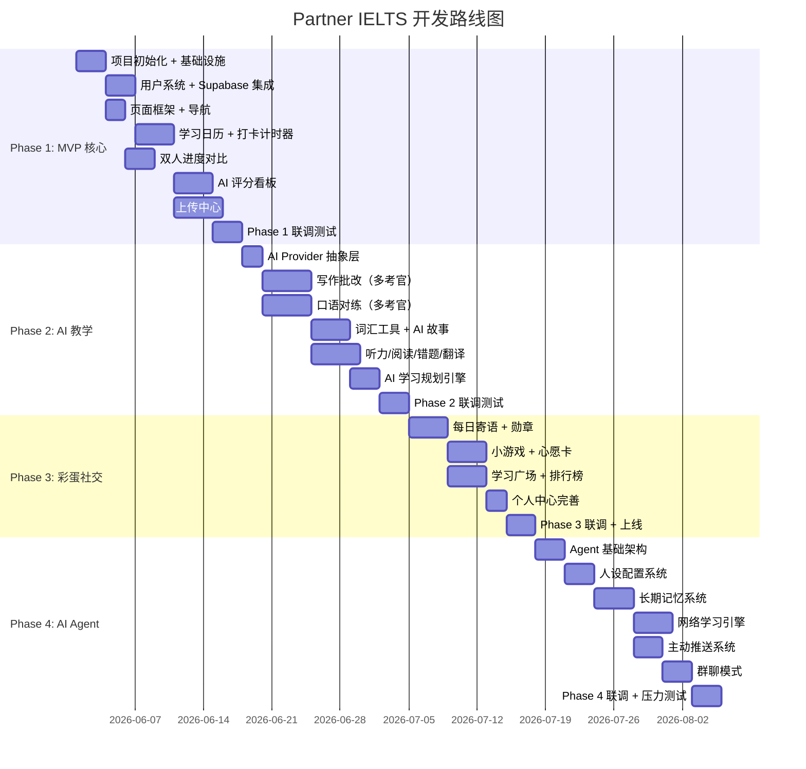

# Partner IELTS（伙伴雅思）— 双人雅思学习网站 PRD

> **版本**: v1.3  
> **日期**: 2026-05-20  
> **作者**: 产品 & 技术团队  
> **状态**: 需求评审中

---

## 6. AI Agent 雅思考官系统（核心亮点）

> 这是本产品最具差异化的功能模块。一个"活的"、会主动学习、会主动找你聊天的 AI 雅思考官。

### 6.1 产品愿景

传统 AI 学习工具是"被动应答"——用户问，它答。

**AI Agent 雅思考官**是"主动伴学"——它主动上网学梗，主动记住你的一切，主动催你学习，主动夸你、批评你，主动给你复盘。

它不只是一个批改工具，而是你和搭子的"学习伙伴"，是每天上线就想聊几句的朋友。

### 6.2 核心能力矩阵

| 能力 | 说明 | 技术实现 |
|------|------|----------|
| **可配置人设** | 选择考官风格（温柔严格/幽默毒舌/学术派） | System Prompt 动态切换 |
| **网络学习引擎** | 主动爬取小红书/知乎/抖音热门内容，更新知识 | 定时任务 + 网络爬虫 MCP |
| **单词例句更新** | 基于热门梗自动更新词库例句，保持新鲜 | AI 内容生成 + 数据库写入 |
| **长期记忆系统** | 记住用户所有学习记录、聊天话题、偏好 | Supabase + 向量数据库 |
| **主动消息推送** | 按设定时间/事件触发主动发消息 | Supabase Edge Functions 定时器 |
| **自由聊天** | 用学到的梗和知识与用户闲聊，雅思话题为主 | RAG 增强生成 |
| **朋友圈感知** | 读取用户动态/朋友圈，了解学习外的生活 | 社交平台 API（预留） |
| **群聊模式** | AI 同时与多用户（搭子双方）互动聊天 | 多会话上下文管理 |
| **主动夸奖/批评** | 根据学习数据自动生成激励文案 | 规则引擎 + AI 生成 |
| **学习复盘** | 每日/每周生成个性化复盘和建议 | 数据分析 + AI 总结 |

### 6.3 人设配置系统

**三种预设人设**：

| 人设 | 语气风格 | 适用场景 | Prompt 关键词 |
|------|----------|----------|--------------|
| **温柔鼓励型** | 温暖、支持、耐心 | 学习初期建立信心 | "你做得很好"、"继续加油" |
| **严格监督型** | 直接、犀利、严格 | 备考中期强化自律 | "你偷懒了"、"这不行"、"必须重写" |
| **幽默毒舌型** | 调侃、玩梗、接地气 | 学习动力不足时激活 | "哈哈你这语法"、"笑死"、"来点阳间英语" |

**自定义选项**：
- 语气强度滑块（1-10）
- 称呼偏好（叫名字/叫昵称/叫"烤鸭人"）
- 性别/虚拟形象（可设置 AI 头像和名字）
- 提醒频率（严苛模式 3 次/天 vs 佛系模式 1 次/天）

### 6.4 网络学习引擎（Web Learning）

> **数据源合规说明**：仅采集公开合法的数据源，支持自建数据 + 官方 API 接口。用户也可主动上传素材供 AI 学习。

**数据采集来源**：

| 来源 | 采集内容 | 采集频率 | 用途 | 合规方式 |
|------|----------|----------|------|----------|
| **新闻网站** | BBC/Reuters/NYT 等英文新闻热点 | 每天 1 次 | 地道表达、话题素材 | RSS 订阅 / 公开 API |
| **Twitter/X** | 英文热门推文、地道表达 | 每天 1 次 | 口语素材、流行梗 | Twitter API (自用) |
| **Telegram** | 英语学习频道内容 | 每天 1 次 | 词汇、例句 | Telegram Bot API |
| **YouTube** | 字幕提取、流行表达 | 每天 1 次 | 听力素材、口语 | YouTube Transcript API |
| **用户上传** | 用户粘贴链接或上传文本 | 实时 | 定制化学习素材 | 用户主动提交 |

**用户素材上传入口**：
- 用户可以粘贴任何英文文本链接（如 Twitter 帖子、新闻文章）
- AI 自动分析并提取适合雅思学习的词汇和表达
- 用户上传的素材优先展示（个性化）

**数据处理流程**：
```
采集/上传原始内容 → AI 清洗+分类 → 提取雅思相关词句 → 存入素材库
                                    ↓
                              更新词库例句
                              更新话题库
                              生成"今日表达"供聊天使用
```

**"今日表达"机制**：
- 每天 AI Agent 会学到 2-5 个最新英语表达/热词
- 存入数据库 `daily_expressions` 表
- 会在每日寄语或聊天中自然融入
- 用户可查看"今日学到了什么"

**技术实现**：
- Twitter API / Telegram Bot API（自用合规）
- Exa/Firecrawl 等搜索 MCP（公开合法）
- Supabase Edge Function 定时任务每天 08:00 执行
- 失败重试 + 用户素材优先

### 6.5 长期记忆系统

**记忆层次**：

```
┌─────────────────────────────────────────────────┐
│                    记忆层                        │
├────────────────┬────────────────┬───────────────┤
│  短期记忆       │    中期记忆     │    长期记忆    │
│  (本轮对话)     │  (近期学习)     │  (全部历史)   │
├────────────────┼────────────────┼───────────────┤
│ 最后聊的话题    │ 最近 7 天学习   │ 所有作文批改   │
│ 今天的情绪状态  │ 本周分数变化    │ 口语薄弱点    │
│ 刚发生的趣事   │ 连续打卡记录    │ 目标分数进度   │
│                │                │ 聊过的所有梗   │
└────────────────┴────────────────┴───────────────┘
```

**存储结构**：

```typescript
// 长期记忆记录
interface MemoryRecord {
  id: string;
  userId: string;
  memoryType: 'chat_topic' | 'learning_progress' | 'personal_fact' | 'exam_result' | 'emoji';
  content: string;         // 记忆内容
  importance: number;      // 重要程度 1-10（AI 自动评估）
  lastReferenced: Date;    // 最后引用时间
  referenceCount: number;  // 被引用次数
  createdAt: Date;
}

// 记忆检索：向量相似度匹配
// 用户问 → 检索相关记忆 → 注入上下文 → 生成回复
```

**记忆召回逻辑**：
- 用户消息 → 向量化 → 检索 Top 5 最相关记忆 → 注入 System Prompt → AI 回复
- 重要记忆（高 importance）权重更高
- 长时间未引用的记忆定期清理（> 90 天无引用 → 自动归档）

### 6.6 主动消息推送

**触发场景**：

| 触发类型 | 触发条件 | 推送内容 | 时间偏好 |
|----------|----------|----------|----------|
| **催学提醒** | 目标时间未打卡 | "今天还没学哦，你昨天说要考 7 分的，快起来！" | 09:00 / 20:00 |
| **夸奖** | 连续打卡 7 天 / 单科提分 / 完成作文 | "连续 7 天了！你这个自律程度我服了 😎" | 即时 |
| **批评** | 连续 3 天未学习 / 计划拖延 | "好家伙，3 天没碰雅思了，你的 7 分计划还活着吗？" | 10:00 |
| **每日复盘** | 每天 22:00 | AI 生成今日学习总结 + 明日建议 | 22:00 |
| **周复盘** | 每周日 21:00 | 本周数据回顾 + 下周计划 | 周日 21:00 |
| **考试成绩** | 用户录入成绩 | AI 分析 + 鼓励/安慰 | 即时 |
| **知识更新** | 学到新梗时 | "今天刷到一个超好笑的英语梗，想听吗？" | 随机 |

**推送频率配置**：
- 用户可设置：关闭 / 佛系（1 次/天）/ 正常（2 次/天）/ 严苛（3 次/天）
- 免打扰时段：23:00 - 09:00 不推送

**技术实现**：
- Supabase Edge Function 定时触发（cron job）
- 或使用 AI Agent 的主动推理循环（Agent Loop）
- 消息内容 AI 实时生成，确保每次不重复

### 6.7 自由聊天模式

**聊天场景**：

| 场景 | 描述 | 示例 |
|------|------|------|
| **雅思相关聊天** | 随时问英语问题，AI 用学到的知识回答 | "这个单词怎么用？" "这个词怎么读？" |
| **学习吐槽** | 抱怨雅思难，AI 适当共情 + 鼓励 | "今天阅读错好多，心态崩了" |
| **梗聊天** | AI 用今天学的梗主动挑起话题 | "你知道最近小红书流行的 XXX 梗吗？" |
| **搭子互动** | AI 读取搭子数据，提起对方进展 | "你搭子今天写了篇作文，你要不要看看？" |
| **考前回放** | AI 根据记忆回顾用户薄弱点 | "还记得上次你 Task 2 逻辑有问题吗？来复习一下" |

**聊天界面设计**：

```
┌──────────────────────────────────────────────────┐
│  🧠 AI 雅思考官 — "考官小雅"           [设置]    │
├──────────────────────────────────────────────────┤
│                                                  │
│  🧠 小雅 08:30                                  │
│  "早上好！今天学了吗？我看你昨天写作文了，         │
│   要不要我帮你复盘一下？"                       │
│                           ← 记住了昨天的事        │
│                                                  │
│  👤 我  08:32                                   │
│  "好啊，昨天的作文感觉逻辑有点乱"                │
│                                                  │
│  🧠 小雅  08:32                                  │
│  "哈哈哈逻辑乱是常见的！我记得上次和你说         │
│   '首先然后最后' 别用太多，来看看你的论点        │
│   是不是有点跳跃？"                             │
│                           ← 引用了上次的对话       │
│                                                  │
│  🧠 小雅  08:33                                  │
│  "顺便说一句，我今天刷到一个小红书的梗：          │
│   '脆皮烤鸭人'，形容备考雅思的我们 😂            │
│   你的目标是几分？"                             │
│                           ← 主动用了今日新梗      │
│                                                  │
├──────────────────────────────────────────────────┤
│ [语音输入 🎤]  [输入框 ......................] [发送] │
└──────────────────────────────────────────────────┘
```

### 6.8 群聊模式

**场景**：搭子双方 + AI Agent 三人同时聊天

**价值**：
- AI 可以同时观察两人的学习状态，调侃双方
- 搭子不想学的时候，AI 可以"拱火"激励
- 两人有争议时，AI 可以做裁判给建议

**聊天示例**：

```
🧠 小雅：你们俩今天都没打卡啊？👀
👤 我：周末嘛～
👤 搭子：他说得对！
🧠 小雅：哈哈你俩倒挺团结。周六整整 6 小时计划呢，
        你们确定要躺平？
👤 我：好的好的我去学…
👤 搭子：你先学我再学
🧠 小雅：@搭子 你刚才 6 分的作文我还没批改完，
        要不要一起看看？先看完再玩！
```

### 6.9 朋友圈/动态感知（Phase 4 后）

**设计说明**：
- 预留接口，未来接入微信朋友圈/小红书动态
- AI 读取用户在非学习场景的动态，了解情绪状态
- 用于更精准的情感调节（用户发旅游照片 → AI 更温和鼓励；用户心情低落 → AI 更支持）

**当前阶段**：Phase 4 仅预留接口，具体接入方式待微信生态成熟后评估。

### 6.10 AI Agent 技术架构

```
┌──────────────────────────────────────────────────────┐
│                    AI Agent                          │
├──────────────────────────────────────────────────────┤
│                                                      │
│  ┌────────────────┐    ┌────────────────────────┐  │
│  │  Memory System  │───▶│   RAG Engine           │  │
│  │  (长期记忆)      │    │   (上下文召回)         │  │
│  └────────┬────────┘    └───────────┬────────────┘  │
│           │                          │               │
│           ▼                          ▼               │
│  ┌───────────────────────────────────────────────┐  │
│  │            Agent Brain (推理引擎)              │  │
│  │  ┌──────────┐ ┌──────────┐ ┌──────────────┐  │  │
│  │  │ Planning │ │ Action   │ │ Reflection   │  │  │
│  │  │  计划    │ │ 执行     │ │ 反思         │  │  │
│  │  └──────────┘ └──────────┘ └──────────────┘  │  │
│  └──────────────────────┬──────────────────────────┘  │
│                         │                             │
│           ┌─────────────┼──────────────┐             │
│           ▼             ▼              ▼             │
│  ┌────────────┐ ┌────────────┐ ┌──────────────┐     │
│  │ Chat      │ │ 主动推送   │ │ 知识更新      │     │
│  │ 对话模块   │ │ 定时触发   │ │ 网络学习      │     │
│  └────────────┘ └────────────┘ └──────────────┘     │
│                                                      │
│  ┌────────────┐ ┌────────────┐ ┌──────────────┐     │
│  │ Web        │ │ 评分系统   │ │ 素材库       │     │
│  │ 爬虫       │ │ 集成       │ │ 集成         │     │
│  └────────────┘ └────────────┘ └──────────────┘     │
│                                                      │
└──────────────────────────────────────────────────────┘
                              │
                              ▼
                    ┌─────────────────┐
                    │   Supabase       │
                    │  DB + Realtime + │
                    │  Edge Functions  │
                    └─────────────────┘
```

### 6.11 AI Agent 数据库扩展

```sql
-- AI Agent 配置
CREATE TABLE agent_config (
  id UUID PRIMARY KEY DEFAULT gen_random_uuid(),
  user_id UUID REFERENCES profiles(id) NOT NULL,
  personality TEXT DEFAULT 'encouraging', -- encouraging / strict / humorous
  name TEXT DEFAULT '考官小雅',
  avatar_url TEXT,
  reminder_frequency TEXT DEFAULT 'normal', -- off / casual / normal / strict
  quiet_hours_start TIME DEFAULT '23:00',
  quiet_hours_end TIME DEFAULT '09:00',
  created_at TIMESTAMPTZ DEFAULT NOW()
);

-- 记忆记录
CREATE TABLE agent_memories (
  id UUID PRIMARY KEY DEFAULT gen_random_uuid(),
  user_id UUID REFERENCES profiles(id) NOT NULL,
  memory_type TEXT NOT NULL, -- chat_topic / learning_progress / personal_fact
  content TEXT NOT NULL,
  importance INTEGER DEFAULT 5,
  last_referenced TIMESTAMPTZ DEFAULT NOW(),
  reference_count INTEGER DEFAULT 0,
  created_at TIMESTAMPTZ DEFAULT NOW()
);

-- 每日梗库
CREATE TABLE daily_memes (
  id UUID PRIMARY KEY DEFAULT gen_random_uuid(),
  source TEXT NOT NULL,           -- xiaohongshu / zhihu / douyin
  keyword TEXT NOT NULL,
  example_sentence TEXT,
  usage_context TEXT,
  learned_at TIMESTAMPTZ DEFAULT NOW()
);

-- 推送日志
CREATE TABLE agent_notifications (
  id UUID PRIMARY KEY DEFAULT gen_random_uuid(),
  user_id UUID REFERENCES profiles(id) NOT NULL,
  type TEXT NOT NULL,             -- reminder / praise / criticism / review
  content TEXT NOT NULL,
  sent_at TIMESTAMPTZ DEFAULT NOW()
);

-- Agent 聊天记录
CREATE TABLE agent_chats (
  id UUID PRIMARY KEY DEFAULT gen_random_uuid(),
  user_id UUID REFERENCES profiles(id) NOT NULL,
  partner_id UUID REFERENCES profiles(id),  -- NULL 表示单人聊天
  message_from TEXT NOT NULL,               -- 'user' / 'agent' / 'partner'
  content TEXT NOT NULL,
  created_at TIMESTAMPTZ DEFAULT NOW()
);
```

### 6.12 Phase 4 验收标准

- [ ] AI Agent 可切换三种人设，风格差异明显
- [ ] 每日自动采集新闻/Twitter/Telegram/YouTube 内容并更新词库
- [ ] AI 能记住用户聊过的所有话题（≥ 50 条记忆）
- [ ] AI 主动推送消息准时，内容不重复
- [ ] AI 会在对话中自然使用今日新梗
- [ ] 群聊模式正常，AI 可同时响应两人
- [ ] 用户可配置提醒频率和免打扰时段
- [ ] AI 复盘内容准确，引用数据无错误

---

## 目录

1. [产品概述](#1-产品概述)
2. [用户画像](#2-用户画像)
3. [竞品分析](#3-竞品分析)
4. [功能需求（分阶段）](#4-功能需求分阶段)
5. [技术架构](#5-技术架构)
6. [AI 集成策略](#6-ai-集成策略)
7. [AI Agent 雅思考官系统（核心亮点）](#7-ai-agent-雅思考官系统核心亮点)
8. [数据模型](#8-数据模型)
9. [页面与组件设计](#9-页面与组件设计)
10. [开发路线图](#10-开发路线图)
11. [可扩展性设计](#11-可扩展性设计)
12. [风险与待决事项](#12-风险与待决事项)
13. [版本变更记录](#13-版本变更记录)

---

## 1. 产品概述

### 1.1 产品定位

**Partner IELTS（伙伴雅思）** 是一款专为"双人搭子"设计的雅思备考 Web 应用。它将打卡监督、AI 智能教学、双人互评、情感激励融为一体，让两个人的雅思备考之旅更高效、更有趣、更有温度。

### 1.2 核心价值主张

| 维度 | 价值 |
|------|------|
| **提分效率** | AI 按雅思评分标准精准批改，薄弱项智能诊断，拒绝盲目刷题 |
| **互相监督** | 双人进度实时可见，打卡数据互通，谁偷懒一目了然 |
| **情感连接** | AI 每日寄语、成就彩蛋、双人小游戏，学习不孤单 |
| **AI 考官伴学** | 一个会刷小红书/知乎/抖音学梗、会主动催你学习、记得你所有进步和偷懒的 AI 考官 |
| **轻量易用** | 浏览器打开即用，无需安装，手机电脑自适应 |
| **自由上传** | 不内置真题（尊重版权），用户自由上传真题/素材，AI 帮你结构化解析 |

### 1.3 目标用户

一对雅思搭子，英语基础良好（CET-4/6 水平），目标分数 6.5-7.0，每周有固定学习时间。

### 1.4 学习节奏（硬编码基准）

| 星期 | 时长 | 说明 |
|------|------|------|
| 周一 | 4 小时 | 听力 1h + 阅读 1.5h + 写作 1h + 口语 0.5h |
| 周二 | 2 小时 | 听力 40min + 阅读 40min + 口语 40min |
| 周三 | 4 小时 | 同周一 |
| 周四 | 2 小时 | 同周二 |
| 周五 | 4 小时 | 同周一 |
| 周六 | 6 小时 | 听力 1.5h + 阅读 1.5h + 写作 1.5h + 口语 1h + 复盘 0.5h |
| 周日 | 6 小时 | 同周六 |

---

## 2. 用户画像

### 2.1 用户 A（发起方）

- 英语水平：已过 CET-6
- 技术背景：懂基础编程，主导 Vibe Coding 开发
- 角色：项目发起人、开发者、"技术合伙人"
- 需求：希望有结构化的学习工具，同时享受搭建过程

### 2.2 用户 B（搭子）

- 英语水平：裸考差点过 CET-6
- 技术背景：非技术背景
- 角色：主要使用者、"产品体验官"
- 需求：简单好用、界面好看、有陪伴感和成就感

---

## 3. 竞品分析

> 基于对同类产品的深度调研，提炼各竞品的核心优势、主要局限及对 Partner IELTS 的设计启发。

### 3.1 雅思学习产品竞品矩阵

| 产品 | 类型 | 核心定位 | AI 功能 | 社区/社交 | 定价 | 月活/规模 |
|------|------|----------|---------|-----------|------|-----------|
| **同桌英语** | 网站+APP | 机考模拟+外教 | AI批改口语答案 | 弱 | 中（¥50-100/课） | 1000万+ |
| **雅思哥** | 移动端+PC | 社区+题库工具 | AI评测（口语+写作） | 🔴 强 | 免费+会员 | 1000万+ |
| **学为贵** | 网站+APP | 系统课程+AI | AI口语陪练矩阵 | 弱 | 中高（¥7000+/课） | 30万+/年 |
| **IELTS Liz** | 网站+YouTube | 免费教程资源 | 无 | 无 | 免费+小额付费 | YouTube 高 |
| **Cambly IELTS** | 网站 | 口语陪练 | 实时对话 | 无 | $11-17/节 | 未公开 |

### 3.2 雅思竞品深度分析

#### 同桌英语 —— 机考模拟之王
**核心优势**：
- 1:1 还原雅思官方机考界面，业界领先
- 口语题库命中率 99%（2026年1-4月题库）
- AI定制口语答案素材（输入关键词生成个性化答案）
- 刘夏来听力语料库（业界权威）

**主要局限**：
- 无系统课程体系，工具属性强
- APP 曾因付费误导被投诉（黑猫投诉平台）
- 王牌外教价格较高，普通外教无视频模式

**启发**：✅ 借鉴机考模拟的高还原度；借鉴"歌词式"答案解析（逐句原文对照）；警惕付费误导投诉

#### 雅思哥 —— 社区之王
**核心优势**：
- 16年题库积累，分类细致（按科目/套题/题型/话题）
- **全球考场回忆**功能——考生实时共享考试真题
- 活跃的"考圈"社区，高分经验分享
- 留学圈延伸（院校数据库、Offer申请）

**主要局限**：
- 社区内容质量参差不齐（知乎用户反映有"搞笑彩蛋"）
- 付费内容与免费内容边界模糊
- 服务器稳定性存疑（临近考试高峰期曾崩溃）

**启发**：✅ 借鉴"考场回忆"机制（用户上传今日考试题目，AI自动整理）；借鉴考圈社区设计（但需克制娱乐化）；学习其从"备考"延伸到"留学申请"的商业模式

#### 学为贵 —— 课程体系之王
**核心优势**：
- GETS真经教学体系（原创方法论+数十本教材）
- 雅思官方白金级合作伙伴（连续10年）
- 师资IP强大（创始人刘洪波225万微博粉丝）
- 全封闭校区（适合脱产备考）
- AI功能矩阵完整（口语陪练+词汇记忆+机考模拟）

**主要局限**：
- 价格信息不透明（需电话咨询）
- 在线课程定价较高（入门班¥6999）
- 依赖创始人个人IP，品牌老化风险

**启发**：✅ 借鉴分层课程设计（入门/强化/冲刺）；借鉴单词记忆的"逻辑词群法"；借鉴从雅思延伸到留学服务的商业模式

#### IELTS Liz —— 免费内容之王
**核心优势**：
- 创始人12年雅思教学经验，内容权威
- 免费内容极丰富（覆盖听说读写四科）
- YouTube视频质量高，讲解清晰
- 高分备考（Band 7+）口碑极佳

**主要局限**：
- 网站界面设计落后
- 无系统课程体系
- 无互动社区

**启发**：✅ 借鉴高质量免费内容的策略（引流）；借鉴简洁的题型技巧讲解方式；学习如何通过YouTube建立影响力

#### Cambly —— 口语陪练之王
**核心优势**：
- 24/7全天候连接母语者 tut者
- 每节课自动录制+转录（方便复习）
- IELTS专项 tut者可筛选

**主要局限**：
- 无系统性考试技巧教学
- tut者水平参差不齐
- 移动端体验差

**启发**：✅ 借鉴课程录制+转录功能；借鉴"drop-in"随时约外教的灵活性；但我们不做真人外教，只做AI

### 3.3 AI英语口语产品竞品分析

| 产品 | 核心功能 | 游戏化 | 定价 | 核心教训 |
|------|----------|--------|------|----------|
| **Speak** | AI角色扮演对话 | 任务驱动 | $13/月 | 对话易重复单调，中高级用户觉得不够挑战 |
| **ELSA Speak** | AI纠音 | 每日课程 | $12/月 | 订阅陷阱投诉多，需要退款机制 |
| **Duolingo** | AI对话Lily | 连续打卡+联赛 | $30/月 | 空洞参与问题——用户为打卡而非学习 |
| **Pingo AI** | AI场景对话 | 游戏化 | 免费+内购 | 免费版限制过多影响体验 |
| **Call Annie** | AI视频通话 | 无 | — | 纯对话无学习内容导致停运 |

**核心启发**：
- **即时反馈是关键**：ELSA Speak 逐音素评分、Speak 的即时语法提示，都是用户最认可的功能
- **避免空洞参与**：Duolingo 的教训——游戏化要有学习成效支撑，不能为游戏而游戏
- **订阅要透明**：ELSA Speak 的退款纠纷提醒我们价格和取消政策必须清晰

### 3.4 社交学习产品竞品分析

| 产品 | 问责机制 | 社交机制 | 游戏化 | 核心教训 |
|------|----------|---------|--------|----------|
| **StudyStream** | 视频直播监督 | 房间+匹配 | 无 | 视频自习室有效，但搭建成本高 |
| **Forest** | 树枯萎惩罚 | 共同种植房间 | 🔴 强 | "共享命运"机制最强——一人放弃全员受损 |
| **Beeminder** | 押金扣款 | 团队目标 | 无 | 经济惩罚最直接，但风险也最大 |
| **Habitica** | HP扣血 | Boss任务 | 🔴 强 | RPG角色绑定长期利益，组队任务惩罚"搭便车" |
| **Timing/同桌APP** | 视频连麦 | 视频直播学习 | 中 | 中国市场验证视频监督模式有效 |

**核心启发**：
- **Forest 的"共享命运"设计最强**：房间中一人离开，所有人的树同时死去——这种机制让搭子间的约束力极强
- **Beeminder 的押金机制**：经济惩罚有效但风险大，我们不照搬，但可以设计"连续打卡断裂后惩罚加倍"的软机制
- **Habitica 的 Boss 任务**：不活跃者拖累全队——我们借鉴为"组队副本模式"中，一人未完成任务扣全队奖励

### 3.5 游戏化学习产品竞品分析

| 产品 | 游戏化机制 | 社交化 | 学习深度 | 核心教训 |
|------|-----------|--------|---------|----------|
| **Wordle** | 每日一次+分享 | 高（分享驱动） | 低 | 稀缺感+零压力分享=病毒传播 |
| **Duolingo** | 打卡+联赛+XP | 中（联赛） | 中 | 连续打卡是最强留存机制，但空洞参与是隐患 |
| **Quizlet** | Match/Gravity游戏 | 中（Live协作） | 中 | 可选游戏模式让不同用户各取所需 |
| **Anki** | 热力图+进度可视化 | 无 | 高 | 间隔重复+进度可视化=极客用户留存 |
| **Cake** | Path流程游戏化 | 中 | 中 | 真实内容+AI即时反馈是口语学习最佳组合 |

**核心启发**：
- **连续打卡+联赛是黄金组合**（Duolingo 验证）：我们设计分级联赛（按目标分数段分组）
- **间隔重复算法是记忆神器**（Anki 验证）：我们必须引入 FSRS 算法用于词汇复习
- **空洞参与问题必须避免**：游戏化要服务于学习目标，不能替代学习目标——我们设置"专注模式"开关
- **真实内容>教材例句**（Cake 验证）：我们用英美剧/BBC片段作为口语导入，而非纯口语教材

### 3.6 竞品总结：我们的差异化定位

| 竞品 | 我们的差异化 |
|------|-------------|
| 同桌英语/雅思哥 | 他们做"工具"，我们做"伙伴"——AI Agent 主动找你聊天，不是你来找工具 |
| 学为贵 | 他们做"课程"，我们做"社交"——搭子互评+组队副本，不是单向听课 |
| IELTS Liz | 他们做"内容"，我们做"激励"——积分+红花+经济闭环，不是枯燥自学 |
| Duolingo | 我们不空洞参与——每次积分获取都有真实的学习内容支撑 |
| Forest | 我们更强社交——搭子互看进度+群聊模式，不只是"树同死" |
| Speak/ELSA | 我们更全面——口语+写作+听力+词汇全科，不只是单一技能 |

---

### 3.7 借鉴清单（Actionable Insights）

| 启发来源 | 借鉴内容 | 落地位置 |
|----------|----------|----------|
| 雅思哥 | 全球考场回忆系统（用户上传真题，AI整理） | Phase 2，错题复盘 |
| 同桌英语 | 机考1:1还原界面 + "歌词式"逐句解析 | Phase 2，听力/阅读 |
| 学为贵 | 分层课程设计（入门/强化/冲刺） | Phase 2，AI学习规划 |
| IELTS Liz | YouTube高质量免费内容引流 | 运营策略 |
| Duolingo | 分级联赛 + 连续打卡保护机制 | Phase 3，英语聊天对战 |
| Forest | "共享命运"机制——搭子房间一人放弃全员受损 | Phase 3，组队副本 |
| Anki | FSRS间隔重复算法用于词汇记忆 | Phase 2，词汇工具 |
| Cake | 真实场景视频作为口语导入素材 | Phase 2，口语对练 |
| Beeminder | 软押金机制——失败时加倍惩罚 | Phase 3，红花系统 |
| StudyStream | 视频直播学习房间（远期规划） | Phase 4，线下联动 |

---

### 3.8 竞品局限与机会

| 竞品局限 | 我们的机会 |
|----------|-----------|
| 雅思哥社区内容质量参差不齐 | 我们的 AI Agent 自动生成高质量学习讨论，而非依赖用户UGC |
| 所有产品缺乏"真正的搭子机制" | 我们从第一天就把"双人搭子"作为核心产品支柱 |
| Speak 等 AI 对话产品对话单调重复 | 我们通过话题分级+每日推荐+搭子对战保持内容新鲜感 |
| 没有产品做经济闭环（积分抵扣订阅） | 我们第一个做红花抵扣月费，让学习真正"值钱" |
| 没有产品做"主动 AI Agent" | 我们是第一个让 AI 主动找你聊天的产品（而非被动问答） |

---

## 4. 功能需求（分阶段）

### 4.1 总体功能地图

```
Partner IELTS
├── 学时管控系统（Phase 1）
│   ├── 学习日历
│   ├── 打卡计时器
│   ├── 双人进度对比
│   └── 连续打卡激励
├── 上传中心（Phase 1）
│   ├── 拖拽上传 + 格式自动识别
│   ├── AI 结构化解析（PDF → 题目/答案/解析）
│   └── 个人素材库管理
├── AI 教学系统（Phase 2）
│   ├── AI 学习规划
│   ├── 听力 AI 精讲
│   ├── 阅读 AI 精讲
│   ├── 写作 AI 批改（多考官模式）
│   ├── 口语 AI 对练（多考官模式）
│   ├── AI 错题复盘
│   └── AI 单词故事生成
├── 评分系统（Phase 1-2）
│   ├── AI 客观评分（多考官交叉验证）
│   ├── 搭子互评
│   ├── 分数趋势图
│   ├── 分数质疑 + 复核
│   └── 学习周报
├── 社交激励系统（Phase 3）
│   ├── 成就勋章墙
│   ├── AI 每日寄语
│   ├── 双人小游戏
│   ├── 心愿约定卡
│   └── 学习动态分享
├── 词汇工具（Phase 2）
│   ├── 雅思词库
│   ├── 闪卡记忆
│   └── AI 单词串故事
├── 翻译工具（Phase 2）
│   └── AI 中英互译
├── 社交功能（Phase 3）
│   ├── 学习广场
│   ├── 搭子匹配
│   └── 排行榜
└── 🧠 AI Agent 雅思考官（Phase 4）
    ├── 可配置人设（温柔/严格/幽默/毒舌）
    ├── 网络学习引擎（新闻/Twitter/Telegram/YouTube）
    ├── 长期记忆系统（记住用户话题和偏好）
    ├── 主动消息推送（催学/夸奖/批评/复盘）
    ├── 自由聊天（用学到的梗和知识）
    ├── 群聊模式（多用户同时互动）
    ├── 朋友圈/动态感知
    └── 词库与例句自动更新
└── 💬 英语聊天对战系统（Phase 3 新增）
    ├── 话题选择系统
    ├── AI/真人聊天对战
    ├── 实时辅助（拼写提示/语法提示）
    ├── 积分积累引擎
    ├── 红花奖励系统
    ├── 排行榜
    ├── 水平分级匹配（L1-L5）
    └── 经济闭环（月费抵扣/积分换礼）
├── 📊 考试倒计时（Phase 3 新增）
│   ├── 倒计时天数展示
│   ├── 目标分 vs 当前分差距
│   └── 冲刺计划
├── 🔔 通知系统（Phase 3 新增）
│   ├── 站内通知
│   ├── 邮件通知
│   └── 通知偏好设置
└── 🎮 游戏系统（Phase 3 扩展）
    ├── 单词 PK
    ├── 句型接龙
    ├── 错题粉碎机
    └── 组队副本模式
```

---

### Phase 1：MVP 核心（2-3 周）

> **目标**：快速上线可用版本，跑通打卡 + 评分 + 双人数据同步三大闭环。

#### P2-0 新手引导流程 🟡 P1（新增）

**功能描述**：

> 让新用户在注册后快速上手，了解产品核心价值，避免"注册后不知道干什么"的用户流失。

**引导流程（共 5 步）**：

```
Step 1: 欢迎页
┌──────────────────────────────────────────────────┐
│  欢迎来到 Partner IELTS！                        │
│                                                  │
│  🎯 你的目标是？                                  │
│  [ ] 6.0  [ ] 6.5  [ ] 7.0  [ ] 7.5+           │
│                                                  │
│  📅 考试日期？                                    │
│  [____年__月__日]                                │
│                                                  │
│  [下一步 ➜]                                     │
└──────────────────────────────────────────────────┘

Step 2: 英语水平测试（可选跳过）
┌──────────────────────────────────────────────────┐
│  📊 想让我们更了解你吗？                          │
│                                                  │
│  做一个小测试（约 5 分钟），我们可以为你生成        │
│  更精准的学习计划。                               │
│                                                  │
│  测试内容：                                       │
│  ✅ 词汇量测试（20 题）                          │
│  ✅ 语法测试（15 题）                             │
│  ✅ 口语录音（3 道题）                            │
│                                                  │
│  [开始测试]  [跳过，直接开始 ➜]                   │
└──────────────────────────────────────────────────┘

Step 3: 绑定搭子
┌──────────────────────────────────────────────────┐
│  👥 找一个学习搭子？                              │
│                                                  │
│  有搭子一起学，效率提升 40%！                     │
│                                                  │
│  输入搭子邮箱：_______________                   │
│  [发送邀请]                                      │
│                                                  │
│  [我有搭子码]  [暂不需要，我自己学 ➜]             │
└──────────────────────────────────────────────────┘

Step 4: AI 学习计划生成
┌──────────────────────────────────────────────────┐
│  🧠 正在为你生成学习计划...                       │
│                                                  │
│  ✅ 分析目标分数...                               │
│  ✅ 评估当前水平...                                │
│  ✅ 计算每日任务...                                │
│  ✅ 分配科目权重...                                │
│                                                  │
│  生成完成！                                      │
│                                                  │
│  📋 你的每日学习计划                              │
│  周一至周五：每天 4 小时                          │
│  周末：每天 6 小时                                │
│                                                  │
│  [查看完整计划 ➜]                                │
└──────────────────────────────────────────────────┘

Step 5: 开始学习
┌──────────────────────────────────────────────────┐
│  🎉 准备就绪！                                    │
│                                                  │
│  今天的学习任务：                                 │
│  ✅ 听力 1 小时                                   │
│  ⬜ 阅读 1.5 小时                                 │
│  ⬜ 写作 1 小时                                   │
│  ⬜ 口语 0.5 小时                                 │
│                                                  │
│  [开始今日学习]                                   │
└──────────────────────────────────────────────────┘
```

**跳过策略**：
- 水平测试可跳过，跳过后默认 L3
- 搭子绑定可跳过，跳过后单人模式可用

**数据沉淀**：
- 引导完成后，用户画像完整（目标分、当前水平、搭子关系）
- 用于后续 AI 个性化推荐

**验收标准**：
- [ ] 5 步引导流程可完整走通
- [ ] 跳过后不影响功能可用
- [ ] AI 学习计划正确生成

#### P2-1 学习日历 + 打卡系统 🔴 P0

**功能描述**：
- 周视图日历，展示本周每天的目标学习时长 vs 实际时长
- 点击某天进入该日学习详情
- 计时器组件：开始学习 → 计时 → 暂停 → 结束，记录每科学习时长
- 今日任务清单，按作息自动生成当日科目分配
- 连续打卡天数可视化（Fire Streak）

**验收标准**：
- [ ] 日历正确显示周一~周日，高亮今日
- [ ] 计时器记录学习时长并自动归属科目
- [ ] 学习时长写入 LocalStorage + 同步 Supabase
- [ ] 连续打卡天数正确计算

#### P2-2 双人进度对比 🔴 P0

**功能描述**：
- 首页顶部显示两人今日学习进度环（已学 / 目标）
- 点击可切换查看对方日历
- 搭子在线状态指示（绿色小圆点）

**验收标准**：
- [ ] 进度环动画流畅
- [ ] 对方数据通过 Supabase Realtime 实时更新
- [ ] 在线状态延迟 < 3 秒

#### P2-3 AI 评分看板 🔴 P0

**功能描述**：
- 两人按听、读、写、口四个维度录入或自动获取 AI 评分
- 雅思 9 分制显示
- 周/月分数折线趋势图（Recharts）
- 双人分数对比

**验收标准**：
- [ ] 折线图正确渲染历史分数
- [ ] 两人数据在同一图表内可对比

#### P2-4 用户系统 🟡 P1

**功能描述**：
- 简单注册/登录（邮箱 + 密码，Supabase Auth）
- 绑定搭子关系（输入对方邮箱或邀请码）
- 个人中心：昵称、头像、目标分数设定

**验收标准**：
- [ ] 注册/登录流程完整
- [ ] 两人绑定后可互相查看数据

#### P2-5 基础页面框架 🟡 P1

**功能描述**：
- 左侧可折叠导航栏（首页、AI 学习中心、备考专区、评分数据、互动彩蛋、个人中心）
- 右侧内容区
- 顶部栏：搭子在线状态 + 今日目标摘要
- 响应式适配：桌面端侧边栏，移动端底部 Tab

**验收标准**：
- [ ] 导航切换流畅
- [ ] 桌面 / 平板 / 手机三端自适应

#### P2-6 上传中心 🔴 P0

**功能描述**：
- **拖拽上传**：支持拖拽文件到页面任意位置触发上传
- **多格式支持**：PDF、Word (.docx)、图片 (PNG/JPG)、文本 (.txt)、音频 (MP3)
- **批量上传**：一次选择/拖入多个文件，显示上传进度队列
- **智能分类**：上传时 AI 自动识别内容类型（剑雅真题 / 听力音频 / 口语题库 / 写作范文 / 词汇表 / 其他），打标签
- **AI 结构化解析**：
  - PDF 真题 → 自动提取题目文本、选项、参考答案
  - 图片 → OCR 识别，AI 补全解析
  - 音频 → 自动转文字稿
- **素材库管理**：
  - 按类型/标签/日期筛选
  - 搜索（文本内容全文搜索）
  - 收藏/归档/删除
  - 查看 AI 解析结果
- **双人共享**：上传的材料可选择是否共享给搭子
- **版权提示**：上传时弹窗提醒"请确认您有权使用此材料，仅供个人学习"

**验收标准**：
- [ ] 拖拽上传交互流畅，支持多文件
- [ ] AI 自动分类准确率 > 80%
- [ ] PDF 文本提取正确
- [ ] 图片 OCR 识别可用
- [ ] 素材库 CRUD 正常
- [ ] 共享材料搭子可见

---

### Phase 2：AI 教学 + 词汇 + 翻译（3-4 周）

> **目标**：上线 AI 雅思教学核心闭环，让 AI 真正替代"老师"角色。

#### P3-1 AI 学习规划引擎 🟡 P1

> **借鉴来源**：学为贵 GETS 分层课程设计（入门/强化/冲刺）

**功能描述**：

**A. 分层学习路径**（参考学为贵）：
- 用户入学时 AI 评估当前水平（Level Test），自动分配学习阶段：
  - 🟢 **入门阶段**（目标 5.0-5.5）：基础巩固，重点词汇、核心语法、简单题型技巧
  - 🟡 **强化阶段**（目标 5.5-6.5）：技巧提升，各科专项训练、复杂题型突破
  - 🔴 **冲刺阶段**（目标 6.5-7.0+）：高分策略，机考模拟、弱项强化、全真模考
- 每个阶段有专属学习内容和目标，避免内容过易（无聊）或过难（放弃）
- AI 实时评估进度，达标后自动晋升到下一阶段

**B. AI 每日学习计划**：
- 根据固定作息自动生成每日学习计划（参考原设计）
- 根据历史错题/低分科目动态调整时间配比
- 每日首次打开首页弹窗展示"今日 AI 学习建议"
- AI 提示词内嵌小红书备考流程逻辑

**验收标准**：
- [ ] 每日计划按作息自动生成
- [ ] 薄弱项诊断逻辑正确（如连续 3 次听力 < 6 分 → 增加听力时长）
- [ ] 分层阶段：入门/强化/冲刺自动分配
- [ ] 阶段晋升条件正确触发

#### P3-2 写作 AI 批改（多考官模式）🔴 P0

**功能描述**：
- 选择 Task 1（图表作文）或 Task 2（大作文）
- 在线编辑器（支持字数统计、倒计时）
- **多考官批改**：提交后可选 1-3 位 AI 考官同时批改
  - 每位考官有不同人设和风格（严格派 / 鼓励派 / 技术派）
  - 各考官独立按四大维度评分
  - 最终得分取平均值或中位数，减少单一模型偏差
- 按雅思四大评分维度批改：
  - Task Achievement / Response
  - Coherence & Cohesion
  - Lexical Resource
  - Grammatical Range & Accuracy
- 批改展示：
  - 🔴 红色标注：语法错误
  - 🟡 黄色标注：可优化句式
  - 🔵 蓝色标注：高阶替换词汇
- 生成：修改稿 + 原版对比 + 扣分原因 + 7 分范文
- **质疑评分**：用户可对 AI 评分点击"质疑"，触发另一位考官复核
- 双人共享批改记录

**验收标准**：
- [ ] 多考官批改返回各自评分+总评
- [ ] 质疑评分机制完整可用
- [ ] 颜色标注正确渲染
- [ ] 批改历史可查看、可对比

#### P3-3 口语 AI 对练（多考官模式）+ AI 纠音师 🔴 P0

**功能描述**：
- **单人模式**：AI 模拟雅思口语考官，严格复刻 Part 1 → Part 2 → Part 3 流程
  - AI 语音播报题目（TTS）
  - 用户录音回答（Web Speech API / MediaRecorder）
  - 可选多考官评估：不同风格考官各自评分
  - 评估维度：流利度、发音、语法、词汇、综合分数
- **双人模式**：一人答题、一人旁听，AI 同步标注双方表现
- 录音回放、历史对练记录
- **质疑评分**：用户可对口语评分提出质疑，触发另一位考官复核
- 周末自动解锁双人对练专项任务

**AI 纠音师（独立模块）**：

> 发音纠正是口语提分的刚需，AI 纠音师专门解决重音、吞音、语调问题。

| 功能 | 说明 |
|------|------|
| **跟读练习** | 用户跟读句子，AI 检测发音 |
| **重音标注** | 标注单词重音位置（如 'important 重音在后） |
| **连读检测** | 检测吞音/连读问题（如 "want to" → "wanna") |
| **语调分析** | 判断语调是否太平板，提示起伏 |
| **正确示范** | AI 给出正确发音示范（带 TTS 播放） |
| **逐音素评分** | 音素级别的评分（细分到每个音是否标准） |

**纠音训练模式**（参考 Cake 真实内容模式）：
- 雅思高频词汇跟读（100 个核心词）
- **真实场景片段跟读**（参考 Cake 英美剧/BBC 片段）：提供英美剧/BBC 纪录片中的雅思相关场景（如学术讲座、机场值机、医院预约等），用户跟读地道表达，AI 评分
- 每日一句：AI 出题 → 用户跟读 → AI 评分 → 进步可视化

**验收标准**：
- [ ] 完整 Part 1-3 流程可走通
- [ ] 录音 + 回放功能正常
- [ ] 多考官评估返回各自评分
- [ ] 质疑评分流程完整
- [ ] 纠音师：重音标注准确率 > 85%
- [ ] 纠音师：逐音素评分可正常展示

#### P3-4 听力 / 阅读 AI 精讲 + 机考模拟 🟡 P1

> **借鉴来源**：同桌英语 1:1 还原机考界面、雅思哥全球考场回忆系统

**功能描述**：

**A. 雅思机考模拟界面**（参考同桌英语）
- 1:1 还原雅思官方机考界面（字体、布局、按钮样式完全一致）
- 听力：30 分钟音频 + 答题纸，音频播放进度条可拖拽，可回听（每题限听 1 次）
- 阅读：60 分钟，文章左侧、题目右侧分栏布局，原文可高亮
- 写作：60 分钟，Task 1/Task 2 切换，字数统计实时显示
- 机考计时器：严格按官方时间，超时自动提交
- 答案解析：**"歌词式"逐句原文对照**（参考同桌英语）
  - 题目答案所在句子高亮显示
  - 逐句英文原文 + 中文翻译（类似歌词逐行显示）
  - 关键词标注（同意替换词、信号词）
  - 可点击任意句子查看语法拆解

**B. 考场回忆系统**（参考雅思哥）
- 用户可在每次考试后上传今日考试题目（图片/文字）
- AI 自动提取：考试日期、考场城市、题目内容
- AI 整理归类：按话题、按科目、按出现频次
- 其他用户可查看"近期考场回忆"作为备考参考
- AI 标注：哪些题目命中率较高

**C. 听力AI精讲**
- 精听逐句断句播放（每句可单独播放、可变速 0.75x/1x/1.25x）
- 同义替换高亮标注（原文词 → 题目选项词）
- 错题 AI 溯源讲解（这道题为什么错，考点是什么）
- 听力场景词词汇卡片（机场、酒店、学术讲座等场景词单独提取）

**D. 阅读AI精讲**
- 长难句语法结构拆解（主谓宾、从句标注）
- 匹配题 / 判断题 / Heading 题专项技巧讲解
- AI 逐题解析（每道题逐一讲解，排除法演示）
- "歌词式"逐句精读：全文英文原文逐句展示，可点击查看生词和语法

**验收标准**：
- [ ] 机考界面还原度 > 95%（对照官方截图）
- [ ] 计时器严格准确，超时自动提交
- [ ] "歌词式"逐句解析：点击任意句子显示翻译和语法拆解
- [ ] 考场回忆：用户可上传，AI 自动整理
- [ ] 同义替换标注正确
- [ ] 精听变速播放流畅
- [ ] 听力音频播放、断句控制正常
- [ ] AI 解析内容格式正确

#### P3-5 AI 错题本 🟡 P1

> **借鉴来源**：雅思哥全球考场回忆系统

**功能描述**：
- 错题自动收录（听力/阅读客观题）
- AI 为每道错题生成：错误原因 + 同类题型解题技巧
- 按科目、题型分类筛选
- 错题重做模式
- **考场回忆整合**：用户上传的考试真题自动进入错题本，标注"近期考过"标签

**验收标准**：
- [ ] 错题增删改查正常
- [ ] AI 解析内容生成正常
- [ ] 考场真题自动标记

#### P3-6 雅思词汇工具 🟡 P1

> **借鉴来源**：Anki FSRS 间隔重复算法

**功能描述**：
- 内置雅思核心词库（按话题/难度分级）
- 闪卡记忆模式（认识/模糊/不认识）
- **FSRS 间隔重复算法**（参考 Anki）：智能调度复习时机，算法根据用户每次记忆反馈动态计算最优复习日期，替代简单艾宾浩斯
  - 每次复习后用户对记忆难度评级（Again/Hard/Good/Easy）
  - 算法计算下次最优复习时间（可能 1 分钟，可能 30 天）
  - 卡片按紧急程度排序，确保最需要复习的卡片优先出现
  - 支持查看记忆曲线（类似 GitHub 热力图）
- **AI 单词串故事**：选择 5-15 个单词 → AI 生成一篇包含这些单词的短文（参考 Cake 真实内容模式，使用地道英文语境）
- 生词本、已掌握词统计
- **学习进度热力图**（参考 Anki）：类似 GitHub 提交记录的可视化日历，显示每日学习投入

**验收标准**：
- [ ] 闪卡翻动动画流畅
- [ ] FSRS 算法正确调度复习时机
- [ ] AI 故事生成包含用户选中的所有单词
- [ ] 记忆曲线热力图正确显示

#### P3-7 AI 翻译工具 🟢 P2

**功能描述**：
- 中→英 / 英→中 双向翻译
- 针对雅思场景优化（学术词汇、正式表达）
- 输入文本 → AI 翻译 → 展示关键替换词汇
- 翻译历史记录

**验收标准**：
- [ ] 翻译结果准确、地道
- [ ] 历史记录可查看

---

### Phase 3：彩蛋 + 社交 + 扩展（2-3 周）

> **目标**：让产品从"好用"变成"离不开"，增加情感粘性和社交传播力。

#### P4-1 AI 每日寄语 🟡 P1

**功能描述**：
- 每日学习结束后，AI 根据两人当日数据生成专属暖心鼓励文案
- 不同场景不同风格：
  - 两人都达标 → 庆祝+鼓励
  - 一人未达标 → 温柔提醒+打气
  - 连续打卡里程碑 → 特别祝贺
- 支持保存到"寄语墙"，形成两人的学习回忆录

**验收标准**：
- [ ] AI 文案风格温暖、不机械
- [ ] 场景判断逻辑正确

#### P4-2 成就勋章系统 🟡 P1

**功能描述**：
- 预设勋章（举例）：
  - 🏅 首次打卡 / 🔥 连续 7 天 / ⚡ 连续 30 天
  - ✍️ 首次 AI 写作批改 / 🎤 首次口语对练
  - 📈 单科提分 0.5 / 总分提分 1.0
  - 💑 双人同时达标 7 天
  - 📝 完成 10 篇作文 / 50 道错题重做
  - 🎯 达成目标分数
- 勋章墙展示（已获得彩色 + 未获得灰色）
- 获得新勋章时弹窗动画

**验收标准**：
- [ ] 勋章解锁条件正确触发
- [ ] 弹窗动画流畅

#### P4-3 双人英语小游戏 + 错题粉碎机 🟢 P2

> **借鉴来源**：Forest "共享命运"机制

**功能描述**：
- **单词 PK**：同一组词，两人限时答题比正确率
- **句型接龙**：AI 出上句 → A 接下句 → B 接 A 的下句 → AI 评分
- **每日挑战**：AI 每日生成一个趣味英语挑战任务
- **🏆 组队副本模式**（参考 Forest "共享命运"机制）：
  - 搭子两人组队打"副本"（如完成一套雅思真题），副本有难度星级（⭐→⭐⭐⭐）
  - **"共享命运"机制**：房间内任何一人未在规定时间内完成任务，**全队奖励减半**（参考 Forest 一人离开所有树同时枯萎）
  - 一人放弃 = 另一人也受损，极强约束力
  - 通关奖励：双人均获得 🌸×20 + 额外积分
  - 冷却：同一副本 24 小时只能挑战一次
  - 搭子可看到对方的答题进度，互相鼓励
- **💥 错题粉碎机**：把错题本当靶子，用户限时抢答，答对越多分数越高；搭子可以 PK，看谁错题消灭得更快

**组队副本模式（RPG 概念）**：

> 让搭子有共同的"战斗目标"，强化搭子绑定。参考 Forest "共享命运"设计——一人放弃，全员受损。

| 元素 | 说明 |
|------|------|
| **副本** | 一套雅思真题（听力/阅读/写作各一个） |
| **难度星级** | ⭐ 入门 / ⭐⭐ 进阶 / ⭐⭐⭐ 冲刺 |
| **通关条件** | 两人均在规定时间内完成，正确率 > 70% |
| **奖励** | 通关奖励：双人均获得 🌸×20 + 额外积分 |
| **冷却** | 同一副本 24 小时只能挑战一次 |
| **搭子协同** | 两人可看到对方的答题进度，互相鼓励 |

**错题粉碎机**：

> 快速消灭错题本，告别反复错同类型题。

- 限时抢答：每题 10 秒，答对得分
- 错题优先：优先展示用户错题本中的题目
- 搭子 PK：两人同时答题，比正确率
- 积分奖励：每答对一道 +10 分
- 消灭可视化：错题本题目逐个"粉碎"，成就感强

**验收标准**：
- [ ] 所有游戏流程完整
- [ ] AI 评分逻辑合理
- [ ] 组队副本：通关条件正确计算
- [ ] 错题粉碎机：优先展示错题

#### P4-4 心愿约定卡 🟢 P2

**功能描述**：
- 两人各自写下"达成目标分数后想一起做的事"
- AI 美化文字，生成精美卡片
- 目标达成时卡片解锁，展示给对方
- 历史约定卡存档

**验收标准**：
- [ ] 卡片创建、存储、解锁流程完整

#### P4-5 学习广场（社交）🟢 P2

**功能描述**：
- 分享每日学习打卡海报（带数据 + AI 寄语）
- 浏览其他搭子的学习动态（匿名化数据）
- 排行榜：本周学习时长 Top 10
- 未来：搭子匹配（找同目标分数、同节奏的学伴）

**验收标准**：
- [ ] 分享海报生成正常
- [ ] 排行榜数据正确

#### P4-6 个人中心完善 🟡 P1

**功能描述**：
- 学习记录汇总（总时长、总打卡天、作文篇数、口语次数）
- AI 复盘笔记列表
- 目标分数设定与变更
- 学习偏好设置（主题色、通知开关）

**验收标准**：
- [ ] 各统计数据正确
- [ ] 设置项可保存

#### P4-6.5 考试倒计时页面 🟡 P1

**功能描述**：

> 利用"紧迫感"驱动学习——让用户时刻清楚距离考试还有多少天，以及每天需要做什么来达成目标。

**核心展示**：
- 首页侧边栏/卡片：显示"距离考试还有 XX 天"（大字醒目）
- 倒计时页面（独立路由 `/countdown`）：

```
┌──────────────────────────────────────────────────┐
│  📅 距离考试还有 67 天                            │
│                                                  │
│  🎯 目标分数：7.0                                │
│  📊 当前评估：6.0                                │
│  ⚡ 差距：1.0 分                                 │
│                                                  │
│  📋 每日任务差距：                                │
│  听力：需提升 0.8 → 每天多练 20 分钟              │
│  阅读：需提升 0.5 → 每天多练 15 分钟              │
│  写作：需提升 1.2 → 每天写 1 段                   │
│  口语：需提升 1.0 → 每天跟读 10 分钟              │
│                                                  │
│  🏃 冲刺计划（第 8-12 周）                        │
│  Week 8: 重点突破听力 Section 3                   │
│  Week 9: 重点突破写作 Task 2 逻辑                 │
│  Week 10: 全科模拟测试                            │
│  ...                                             │
│                                                  │
│  💡 AI 建议：你的写作逻辑是最大短板，建议            │
│     本周专注练习 Task 2 四段式结构。                │
└──────────────────────────────────────────────────┘
```

**动态更新**：
- 每日学习数据变化时，差距自动重算
- AI 根据进度变化动态调整冲刺计划

**验收标准**：
- [ ] 倒计时天数正确（基于用户设定的考试日期）
- [ ] 目标分 vs 当前分差距正确显示
- [ ] 冲刺计划可展开/收起
- [ ] AI 建议随学习数据变化动态更新

#### P4-7 英语聊天对战系统 🔴 P0（核心商业化功能）

**产品定位**：
将"英语聊天"变成一种可持续的激励机制——用户通过英文对话积累积分，积分可以抵扣订阅费或兑换实物奖励，形成"越聊越省钱/越聊越赚钱"的正向循环。

##### 7.1 话题选择系统

**功能描述**：
- 进入聊天对战前，先选择话题（决定场景难度和奖励倍率）
- 话题分级：

| 级别 | 话题举例 | 难度 | 积分倍率 |
|------|----------|------|----------|
| 🟢 日常 | Shopping, Weather, Hobbies, Weekend plans | 简单 | ×1.0 |
| 🟡 生活 | Travel, Food, Movies, Making friends | 中等 | ×1.5 |
| 🔴 学术 | Climate change, AI ethics, Urbanization | 困难 | ×2.0 |
| 🏆 雅思 | Discussing advantages/disadvantages, Giving opinions | 雅思口语 | ×2.5 |

- 每日/每周有推荐话题（带 🔥 标签），选推荐话题额外 +20% 积分
- 搭子对战时，双方必须选择同一话题

**验收标准**：
- [ ] 话题选择交互流畅
- [ ] 难度与积分倍率正确计算

##### 7.2 聊天对战模式 + 水平分级匹配

**三种对战模式**：

| 模式 | 对象 | 说明 | 积分获取 |
|------|------|------|----------|
| **AI 对战** | AI Agent | 与 AI 雅思考官自由聊天 | 正常积分 |
| **搭子对战** | 你的雅思搭子 | 两人限时英文聊天 | 正常积分 + 双人组队奖励 |
| **匹配对战** | 随机用户 | 系统随机匹配同水平用户 | 正常积分 + 胜利奖励 |
| **旁观模式** | — | 搭子对战时可旁观学习 | 无积分，但可偷学长句 |

**水平分级匹配系统**：

> 匹配对战时，确保用户只与同水平的人对战，避免新手 vs 高级用户的糟糕体验。

| 等级 | 名称 | 说明 | 匹配范围 |
|------|------|------|----------|
| L1 | 🌱 初学者 | 词汇量 < 3000，刚接触雅思 | 仅匹配 L1-L2 |
| L2 | 📖 进阶者 | 词汇量 3000-5000，CET-4 水平 | 匹配 L1-L3 |
| L3 | 🎯 中级者 | 词汇量 5000-7000，目标 6.0-6.5 | 匹配 L2-L4 |
| L4 | ⭐ 高级者 | 词汇量 7000-9000，目标 7.0+ | 匹配 L3-L5 |
| L5 | 👑 精通者 | 词汇量 9000+，目标 7.5+ | 仅匹配 L4-L5 |

**定级测试**：
- 新用户注册后，可选择做"英语水平测试"（AI 评估）
- 测试内容：词汇量测试 + 语法测试 + 口语录音
- 测试结果 → 确定初始等级
- 用户可随时重新测试提升等级

**对战流程**：
1. 双方选择话题（搭子对战需协商同一话题）
2. AI 介绍场景背景（1-2 句话）
3. 开始聊天，计时（默认 10 分钟，可延长）
4. 双方用英文交流，AI 实时监测
5. 时间到 → 结束 → AI 评分 → 展示结果

**验收标准**：
- [ ] 三种模式完整可用
- [ ] 计时器准确
- [ ] 双方消息实时同步

##### 7.3 实时辅助系统（聊天框内）

**拼写提示**：
- 用户输入时，实时检测单词拼写
- 拼写错误的单词用红色下划线标注
- 鼠标悬停显示正确拼写（不强制更正，用户可自己改）
- 触发：用户停止输入 300ms 后检测

**语法提示**：
- 用户发送消息后，AI 实时分析语法
- 正确表达：绿色小勾 + 鼓励文案 "Great job!"
- 小错误：黄色提示 + 解释 "Consider using 'although' here"
- 大错误：红色标注 + 修改建议（用户可选择"立即修改"）

**实时积分预览**：
- 每次发送消息后，实时显示本次获得积分
- 积分图标动画飘起 (+5 🪻, +8 🪻 等)

**辅助等级**：
- 新手模式：拼写+语法全开，每句都有反馈
- 进阶模式：仅拼写提示，语法仅在明显错误时提示
- 自由模式：关闭辅助，纯聊天

**验收标准**：
- [ ] 拼写错误检测准确率 > 90%
- [ ] 语法提示延迟 < 1 秒
- [ ] 辅助等级切换即时生效

##### 7.4 积分积累引擎

**积分获取规则**：

| 行为 | 积分 | 说明 |
|------|------|------|
| 发送一条英文消息（≥10词） | +2 | 基础分 |
| 使用高级词汇（AI判定） | +3 | 奖励使用地道表达 |
| 使用复杂句型（从句/倒装） | +3 | 奖励语法多样性 |
| 对方先发送后回复（接龙加成） | +1 | 鼓励互动 |
| 连续聊天 5 分钟不断 | +5 | 专注奖励 |
| 完成一场 10 分钟对战 | +20 | 完成奖励 |
| 赢得对战（评分更高） | +15 | 胜利奖励 |
| 使用当日推荐话题 | +20% | 推荐加成 |
| 搭子组队完成对战 | +10 | 组队加成 |

**积分计算示例**：

> 你发送："I've been thinking about studying abroad, but the tuition fees are really expensive and I'm worried about the financial burden."
> AI 检测：使用了 "been thinking about", "studying abroad", "financial burden" 等高级词汇，包含 although 让步从句结构。
> 本次积分：2（基础）+ 3×3（3个高级词汇）+ 3（从句）= **14 分**

**积分防刷机制**：
- 同一话题重复使用相同句式 → 积分打折（×0.5）
- 消息过短（<5 词）→ 0 积分
- 检测到机器翻译特征 → 不计积分
- 每小时积分上限：100 分
- 每日积分上限：500 分

**验收标准**：
- [ ] 积分计算逻辑正确
- [ ] 防刷机制有效
- [ ] 积分历史可查

##### 7.5 红花奖励系统

**红花（🌸）是什么**：
- 红花是"成就感"的视觉符号，也是经济奖励的凭证
- 1 红花 = ¥1 元，可在积分商城兑换

**红花获取渠道**：

| 来源 | 数量 | 说明 |
|------|------|------|
| 每日首次完成对战 | +1 | 鼓励持续参与 |
| 连续聊天 7 天 | +5 | 连续奖励 |
| 连续聊天 30 天 | +20 | 月度奖励 |
| 搭子对战胜利 | +3 | 竞技奖励 |
| 单句获得"Perfect"评价 | +1 | 优秀单句 |
| 周排行榜前 3 | +5/+3/+1 | 排名奖励 |
| 月度目标达成 | +10 | 里程碑 |

**红花展示**：
- 用户个人主页显示持有的红花数量 🌸×42
- 红花获得时有动画（飘落效果）
- 红花历史记录（收支明细）

**验收标准**：
- [ ] 红花获取规则正确
- [ ] 动画效果流畅
- [ ] 历史记录可查

##### 7.6 成就与徽章绑定

**红花相关徽章**：

| 徽章 | 条件 | 红花奖励 |
|------|------|----------|
| 🌱 初出茅庐 | 首次完成聊天对战 | +2 |
| 🔥 一周一战 | 连续 7 天每天至少一场 | +5 |
| 💬 话痨达人 | 累计发送 500 条英文消息 | +8 |
| 🗣️ 口语达人 | 累计获得 100 次"Great"评价 | +10 |
| 🏆 常胜将军 | 赢得 20 场对战 | +15 |
| 🌸 花语者 | 累计获得 100 红花 | +20 |
| 👑 月度王者 | 月排行榜第 1 | +50 |
| 🎯 完美表达 | 一次性使用 5 个高级词汇 | +5 |

**复合成就（同时触发多个奖励）**：
- "话痨达人 + 一周一战" → 解锁 🔥🔥🔥 成就，额外 +10 红花

**验收标准**：
- [ ] 所有徽章解锁条件正确
- [ ] 红花奖励即时到账
- [ ] 徽章动画解锁效果流畅

##### 7.7 排行榜系统 + 分级联赛

> **借鉴来源**：Duolingo 联赛系统（按实力自动分组，确保每组都有"可以赢"的用户）

**排行榜类型**：

| 排行榜 | 维度 | 更新频率 | 展示 |
|--------|------|----------|------|
| 周积分榜 | 本周积分总和 | 实时 | Top 10 + 我的排名 |
| 月积分榜 | 本月积分总和 | 实时 | Top 10 + 我的排名 |
| 红花榜 | 累计红花数量 | 实时 | Top 10 + 我的排名 |
| 搭子双人榜 | 双人累计积分 | 实时 | 搭子专属榜 |

**分级联赛系统**（参考 Duolingo）：
- 用户按**目标分数段**自动分组（同分段内竞争）：
  - 🟢 青铜组（目标 5.0-5.5）：入门选手，互相追赶
  - 🟡 白银组（目标 5.5-6.0）：初具基础，需要坚持
  - 🔴 黄金组（目标 6.0-6.5）：中坚力量，竞争激烈
  - 🟣 钻石组（目标 6.5-7.0）：高分冲刺，需要策略
  - 🏆 王者组（目标 7.0+）：顶尖高手，全力以赴
- 每周积分排名前列者晋升（青铜→白银→黄金→钻石→王者）
- 排名末尾者降级（形成压力，但不至完全垫底）
- **确保每组都有"可以赢"的用户**（参考 Duolingo 设计，避免强弱悬殊导致放弃）
- 青铜组设置积分保护机制（低于基准分不会降级，鼓励持续参与）

**排行榜激励**：
- Top 3 显示头像 + 名次 + 红花奖励
- 我的排名区域高亮显示
- 每周一 09:00 重置周榜，生成上周周报
- 组别晋升/降级时发送通知

**专注模式**（参考 Duolingo "空洞参与"教训）：
- 用户可一键关闭所有游戏化元素（排行榜/积分/红花动画）
- 进入"纯学习模式"——只显示学习内容和进度，无任何激励干扰
- 切换即时生效，适合深度学习时段

**验收标准**：
- [ ] 排行榜数据正确
- [ ] 周榜按时重置
- [ ] 排名变化有动画
- [ ] 分级联赛：5 组按目标分自动分组
- [ ] 晋升/降级逻辑正确
- [ ] 专注模式：一键关闭所有游戏化元素

##### 7.8 经济闭环设计

**订阅模式**：

| 方案 | 价格 | 内容 | 积分权益 |
|------|------|------|----------|
| 免费用户 | ¥0 | 每天 3 场对战 + 基础辅助 | 积分可提现（上限 20/月） |
| 月度会员 | ¥50/月 | 无限对战 + 高级辅助 + 优先匹配 | 积分可抵扣下月订阅费 |
| 季度会员 | ¥120/季 | 同上 + 专属话题 + 专属徽章 | 积分可抵扣下季度订阅费 |
| 年度会员 | ¥400/年 | 同上 + 1 次免费 1v1 外教课 | 积分可抵扣下年订阅费 |

**积分抵扣规则**：
- 100 积分 = ¥1，抵扣下限 100 分（即 ¥1）
- 每月最高抵扣：月会员可抵扣 50%（¥25）
- 季度会员可抵扣 30%（¥12/季）
- 年度会员可抵扣 20%（¥6.6/月）
- 积分过期：获得后 365 天内有效

**积分换礼商城**（Phase 4 同期上线，仅虚拟商品）：

| 商品 | 所需红花 | 说明 |
|------|----------|------|
| StarBucks 咖啡券 | 🌸×50 | 电子券（自动发放） |
| 雅思真题集（电子版） | 🌸×200 | 官方真题 PDF（自动下载） |
| AI 口语私教课（30分钟） | 🌸×500 | 1v1 定制课程（预约排课） |
| AI 写作批改次数（×10） | 🌸×100 | 额外批改额度 |
| 雅思核心词汇 PDF（精选版） | 🌸×80 | 分类词汇表 |
| 🏆 月度排行榜专属徽章 | 🌸×150 | 荣誉标识 |
| 搭子双人组队礼包 | 🌸×300 | 包含双方各 5 次批改 + 1 次口语课 |

> **实物商品说明**：初期仅提供虚拟商品，实物奖励（拍立得/AirPods 等）待平台规模扩大后评估。

**验收标准**：
- [ ] 订阅收费流程完整（支付集成）
- [ ] 积分抵扣计算正确
- [ ] 商城兑换流程完整
- [ ] 提现机制防刷

##### 7.9 技术实现要点

**聊天实时同步**：
- Supabase Realtime 订阅消息 channel
- 搭子对战双方实时收发消息

**AI 语法检测**：
- 用户发送消息 → 传入 AI 分析接口 → 返回标注结果
- 检测延迟目标 < 1 秒

**积分防刷算法**：
- 服务端记录每次积分获取的上下文
- 异常检测：同一 IP / 同一用户短时间内大量积分
- 人工复核通道：可疑账户可冻结

**支付集成**：
- Phase 3 先做积分商城虚拟商品
- Phase 4 接入真实支付（月费订阅 + 实物奖励）
- 技术选型：微信支付 / 支付宝（国内）；Stripe（海外）

**数据库扩展**：

```sql
-- 聊天对战记录
CREATE TABLE chat_battles (
  id UUID PRIMARY KEY DEFAULT gen_random_uuid(),
  user_id UUID REFERENCES profiles(id) NOT NULL,
  opponent_id UUID REFERENCES profiles(id),  -- NULL 表示 AI 对战
  topic TEXT NOT NULL,
  difficulty TEXT NOT NULL,
  duration_seconds INTEGER NOT NULL,
  messages JSONB,                           -- 聊天记录
  score INTEGER,                            -- AI 评分
  points_earned INTEGER,                    -- 获得积分
  winner TEXT,                              -- 'user' / 'opponent' / 'ai'
  created_at TIMESTAMPTZ DEFAULT NOW()
);

-- 积分记录
CREATE TABLE points_history (
  id UUID PRIMARY KEY DEFAULT gen_random_uuid(),
  user_id UUID REFERENCES profiles(id) NOT NULL,
  source TEXT NOT NULL,                     -- 'chat_message' / 'battle_win' / 'achievement'
  points INTEGER NOT NULL,
  description TEXT,
  battle_id UUID REFERENCES chat_battles(id),
  created_at TIMESTAMPTZ DEFAULT NOW()
);

-- 红花记录
CREATE TABLE flowers_history (
  id UUID PRIMARY KEY DEFAULT gen_random_uuid(),
  user_id UUID REFERENCES profiles(id) NOT NULL,
  type TEXT NOT NULL,                       -- 'earned' / 'spent' / 'expired' / 'withdrawn'
  amount INTEGER NOT NULL,
  source TEXT,                              -- 'achievement_unlock' / 'exchange' / 'withdraw'
  description TEXT,
  created_at TIMESTAMPTZ DEFAULT NOW()
);

-- 商城商品
CREATE TABLE rewards (
  id UUID PRIMARY KEY DEFAULT gen_random_uuid(),
  name TEXT NOT NULL,
  description TEXT,
  cost_flowers INTEGER NOT NULL,
  stock INTEGER,                           -- NULL 表示无限
  type TEXT NOT NULL,                      -- 'virtual' / 'physical' / 'coupon'
  created_at TIMESTAMPTZ DEFAULT NOW()
);

-- 兑换记录
CREATE TABLE exchanges (
  id UUID PRIMARY KEY DEFAULT gen_random_uuid(),
  user_id UUID REFERENCES profiles(id) NOT NULL,
  reward_id UUID REFERENCES rewards(id) NOT NULL,
  flowers_spent INTEGER NOT NULL,
  status TEXT DEFAULT 'pending',           -- pending / delivered / expired
  delivered_at TIMESTAMPTZ,
  created_at TIMESTAMPTZ DEFAULT NOW()
);
```

---

#### P4-8 每日推荐话题 🟡 P1

**功能描述**：
- AI Agent 根据近期热门事件，生成 1-3 个每日推荐话题
- 推荐话题带 🔥 标签，选择后额外 +20% 积分
- 推荐理由："这个话题最近很火哦"
- 推荐话题每 24 小时刷新

**验收标准**：
- [ ] 每日推荐话题正确显示
- [ ] 额外积分正确计算

#### P4-9 通知系统 🔴 P0（新增）

**功能描述**：

> 统一的通知系统，确保用户不会错过重要信息，同时避免过度打扰。

**通知渠道**：

| 渠道 | 优先级 | 说明 |
|------|--------|------|
| **站内通知** | 🔴 必须 | 应用内通知中心，实时推送 |
| **邮件通知** | 🟡 推荐 | 重要消息邮件提醒（可关闭） |
| **Web Push** | 🟡 可选 | 浏览器推送（需用户授权） |

**通知类型**：

| 类型 | 触发条件 | 渠道 | 说明 |
|------|----------|------|------|
| **学习提醒** | 目标时间未打卡 | 站内 + 邮件 | AI 主动催学 |
| **搭子动态** | 搭子完成学习/获奖 | 站内 | 搭子进度通知 |
| **成就解锁** | 获得新徽章 | 站内 | 即时成就感 |
| **对战邀请** | 搭子发起对战 | 站内 + 邮件 | 可一键接受 |
| **AI 寄语** | 每日学习结束 | 站内 | 温暖鼓励 |
| **积分到账** | 获得红花/积分 | 站内 | 即时反馈 |
| **系统公告** | 重要功能更新 | 站内 + 邮件 | 官方通知 |

**通知偏好设置**：

```
通知偏好
├── 📚 学习提醒
│   ├── 开启/关闭
│   ├── 提醒时间：[09:00] [20:00]
│   └── 免打扰时段：23:00 - 09:00
├── 🎮 对战通知
│   ├── 开启/关闭
│   └── 有人邀请时通知
├── 🎯 成就通知
│   ├── 开启/关闭
│   └── 显示详情
├── 📧 邮件通知
│   ├── 开启/关闭
│   └── 哪些类型发邮件：[ ] 学习提醒 [ ] 搭子动态 [ ] 系统公告
└── 🔔 Push 推送
    ├── 开启/关闭（需浏览器授权）
    └── 仅重要通知
```

**通知中心 UI**：

```
┌──────────────────────────────────────────────────┐
│  🔔 通知中心                              [全部已读] │
├──────────────────────────────────────────────────┤
│                                                  │
│  🧠 AI 小雅 刚刚                                 │
│  "今天还没学哦，你的 7 分计划还活着吗？ 😂"        │
│  [开始学习]  [稍后提醒]  10 分钟前              │
│                                                  │
│  👥 搭子小明 刚刚                                 │
│  "完成了今日写作练习 🎉"                         │
│  查看结果  30 分钟前                             │
│                                                  │
│  🏆 系统 昨天                                    │
│  "恭喜获得 🏅 首次打卡 成就！+2 🌸"              │
│  查看徽章  昨天 14:30                            │
│                                                  │
│  🎮 对战邀请 昨天                                 │
│  "小明邀请你来一场英语对战"                       │
│  [接受] [拒绝]  昨天 10:00                      │
│                                                  │
└──────────────────────────────────────────────────┘
```

**验收标准**：
- [ ] 站内通知实时推送
- [ ] 邮件通知可关闭
- [ ] 免打扰时段生效
- [ ] 通知历史可查
- [ ] 已读/未读状态正确

---

### 4.3 用户补充功能确认

| 功能 | 优先级 | 归属阶段 | 说明 |
|------|--------|----------|------|
| 背单词 | 🟡 P1 | Phase 2 | 闪卡 + 词库 + AI 故事 |
| AI 单词串故事 | 🟡 P1 | Phase 2 | 属于词汇工具子功能 |
| 翻译功能 | 🟢 P2 | Phase 2 | AI 中英互译 |
| 社交功能 | 🟢 P2 | Phase 3 | 学习广场 + 排行榜 |
| 微信认证 | 🟢 P3 | Phase 3+ | 未来扩展 |
| 小程序版 | 🟢 P3 | Phase 3+ | 未来扩展 |
| AI Agent 雅思考官 | 🔴 P0 | Phase 4 | 主动学习+记忆+聊天+推送+群聊 |

---

## 5. 技术架构

### 11.1 技术选型

| 类别 | 选型 | 理由 |
|------|------|------|
| 框架 | React 18 + TypeScript | 类型安全、生态丰富、Vibe Coding 友好 |
| 构建工具 | Vite 5 | 毫秒级 HMR，开发体验极佳 |
| 样式方案 | TailwindCSS + shadcn/ui | 原子化 CSS + 高质量组件，颜值有保证 |
| 状态管理 | Zustand | 轻量、TS 友好、无 boilerplate |
| 路由 | React Router v6 | 标准方案 |
| 图表 | Recharts | React 原生、声明式 API |
| 后端/BaaS | Supabase | Auth + DB + Realtime + Storage 一站式 |
| AI SDK | Vercel AI SDK (`ai` + `@ai-sdk/openai`) | 统一抽象层，一行切换模型供应商 |
| 语音识别 | Web Speech API / MediaRecorder | 浏览器原生，零额外依赖 |
| 语音合成 | Web Speech API (TTS) | 同上 |
| 部署 | Vercel / GitHub Pages | 免费、自动 CI/CD |

### 11.2 AI 抽象层设计（核心架构决策）

为满足"先兼容、后选择"的需求，AI 调用通过 **Provider Adapter Pattern** 抽象：

```typescript
// src/services/ai/types.ts
interface AIProvider {
  id: string;
  name: string;
  chat(messages: ChatMessage[], options?: ChatOptions): Promise<ChatResponse>;
  speechToText?(audio: Blob): Promise<string>;
  textToSpeech?(text: string): Promise<ArrayBuffer>;
}

// src/services/ai/providers/
// ├── deepseek.ts        → DeepSeek Provider
// ├── openai.ts          → OpenAI / GPT-4o Provider
// ├── wenxin.ts          → 百度文心 Provider
// └── xunfei.ts          → 讯飞星火 Provider

// 运行时选择 Provider
const provider = createProvider(import.meta.env.VITE_AI_PROVIDER || 'deepseek');
```

**核心 AI 能力接口**：

```
IELTS AI Service
├── evaluateWriting(essay, taskType)  → WritingFeedback
├── evaluateSpeaking(audio)           → SpeakingEvaluation
├── generateStudyPlan(userData)       → StudyPlan
├── analyzeMistake(question, answer)  → MistakeAnalysis
├── generateDailyMessage(stats)       → string
├── generateWordStory(words)          → string
├── translate(text, direction)        → string
├── generateExamTip(topic, weakness)  → string
└── gradeListening(answers, key)      → ListeningScore
```

### 11.3 数据流架构

```
┌─────────────────┐         ┌─────────────────┐
│   用户 A 浏览器   │         │   用户 B 浏览器   │
│  ┌───────────┐  │         │  ┌───────────┐  │
│  │ Zustand   │  │         │  │ Zustand   │  │
│  │ (本地状态)  │  │         │  │ (本地状态)  │  │
│  └─────┬─────┘  │         │  └─────┬─────┘  │
│        │         │         │        │         │
│  ┌─────▼─────┐  │         │  ┌─────▼─────┐  │
│  │LocalStorage│  │         │  │LocalStorage│  │
│  └─────┬─────┘  │         │  └─────┬─────┘  │
│        │         │         │        │         │
└────────┼─────────┘         └────────┼─────────┘
         │                            │
         └──────────┬─────────────────┘
                    │
           ┌────────▼────────┐
           │    Supabase      │
           │  ┌────────────┐  │
           │  │  Auth ─────│──│→ 用户认证
           │  │  Database ─│──│→ 学习数据+评分
           │  │  Realtime  │──│→ 双人数据实时同步
           │  │  Storage   │──│→ 语音/图片文件
           │  └────────────┘  │
           └────────┬────────┘
                    │
           ┌────────▼────────┐
           │   AI Provider    │
           │  (DeepSeek/      │
           │   OpenAI/文心)   │
           └─────────────────┘
```

### 11.4 项目目录结构

```
partner-ielts/
├── public/
│   └── favicon.svg
├── src/
│   ├── components/
│   │   ├── ui/                      # shadcn/ui 基础组件
│   │   ├── layout/
│   │   │   ├── AppLayout.tsx        # 主布局
│   │   │   ├── Sidebar.tsx          # 桌面侧边导航
│   │   │   ├── MobileNav.tsx        # 移动端底部导航
│   │   │   └── TopBar.tsx           # 顶部栏
│   │   ├── dashboard/
│   │   │   ├── StudyCalendar.tsx    # 学习日历
│   │   │   ├── TodayTask.tsx        # 今日任务
│   │   │   ├── DualProgress.tsx     # 双人进度环
│   │   │   └── StreakBadge.tsx      # 连续打卡
│   │   ├── study/
│   │   │   ├── WritingModule.tsx    # AI 写作批改
│   │   │   ├── SpeakingModule.tsx   # AI 口语对练
│   │   │   ├── ListeningModule.tsx  # AI 听力训练
│   │   │   ├── ReadingModule.tsx    # AI 阅读训练
│   │   │   └── ReviewModule.tsx     # AI 错题复习
│   │   ├── vocab/
│   │   │   ├── FlashCard.tsx        # 闪卡记忆
│   │   │   ├── WordStory.tsx        # AI 单词串故事
│   │   │   └── WordList.tsx         # 词库浏览
│   │   ├── tools/
│   │   │   └── Translator.tsx       # AI 翻译
│   │   ├── score/
│   │   │   ├── ScoreBoard.tsx       # AI 评分看板
│   │   │   ├── TrendChart.tsx       # 分数趋势图
│   │   │   └── StudyReport.tsx      # 学习周报
│   │   ├── social/
│   │   │   ├── MedalWall.tsx        # 成就勋章墙
│   │   │   ├── DailyMessage.tsx     # AI 每日寄语
│   │   │   ├── MiniGame.tsx         # 双人小游戏
│   │   │   ├── WishCard.tsx         # 心愿约定卡
│   │   │   ├── ShareCard.tsx        # 分享海报
│   │   │   └── Leaderboard.tsx      # 排行榜
│   │   ├── auth/
│   │   │   ├── LoginForm.tsx        # 登录
│   │   │   ├── RegisterForm.tsx     # 注册
│   │   │   └── PartnerBind.tsx      # 搭子绑定
│   │   └── profile/
│   │   ├── UserProfile.tsx      # 用户信息
│   │   ├── StudyHistory.tsx     # 学习记录
│   │   └── GoalSetting.tsx      # 目标设定
│   ├── onboarding/
│   │   ├── WelcomeStep.tsx      # 新手引导-欢迎页
│   │   ├── LevelTestStep.tsx    # 新手引导-水平测试
│   │   ├── PartnerBindStep.tsx  # 新手引导-绑定搭子
│   │   ├── PlanGenerateStep.tsx  # 新手引导-生成计划
│   │   └── OnboardingComplete.tsx # 新手引导-完成
│   ├── chat/
│   │   ├── ChatBattle.tsx       # 英语聊天对战
│   │   ├── TopicSelector.tsx    # 话题选择
│   │   ├── MatchMaker.tsx       # 水平分级匹配
│   │   ├── SpeakingAid.tsx      # AI 纠音师
│   │   ├── PointsPreview.tsx    # 实时积分预览
│   │   └── GrammarHelper.tsx    # 语法提示
│   ├── games/
│   │   ├── WordPK.tsx           # 单词 PK
│   │   ├── SentenceChain.tsx    # 句型接龙
│   │   ├── MistakeDestroyer.tsx # 错题粉碎机
│   │   └── TeamDungeon.tsx      # 组队副本
│   ├── countdown/
│   │   └── ExamCountdown.tsx    # 考试倒计时
│   ├── notification/
│   │   ├── NotificationCenter.tsx # 通知中心
│   │   ├── NotificationList.tsx    # 通知列表
│   │   └── NotificationSettings.tsx # 通知设置
│   └── agent/
│       ├── AgentChat.tsx        # AI Agent 聊天界面
│       ├── AgentSettings.tsx    # 人设配置
│       ├── MemoryWall.tsx       # 记忆墙（可见 AI 记住的内容）
│       ├── NotificationLog.tsx  # 推送记录
│       └── MemeLibrary.tsx      # 今日梗库
├── hooks/
│   │   ├── useTimer.ts              # 学习计时器
│   │   ├── useSpeechRecognition.ts  # 语音识别
│   │   ├── useAI.ts                 # AI 调用封装
│   │   ├── useStudySync.ts          # 双人数据同步
│   │   ├── useAuth.ts               # 认证状态
│   │   ├── useNotifications.ts      # 通知系统
│   │   └── useOnboarding.ts         # 新手引导状态
│   ├── services/
│   │   ├── ai/
│   │   │   ├── types.ts             # AI 接口类型
│   │   │   ├── provider.ts          # Provider 工厂
│   │   │   ├── providers/           # 各 AI 供应商实现
│   │   │   └── prompts/             # 雅思专用提示词模板
│   │   ├── supabase.ts              # Supabase 客户端
│   │   ├── storage.ts               # LocalStorage 封装
│   │   └── ieltsScoring.ts          # 雅思评分换算
│   ├── store/
│   │   ├── authStore.ts             # 认证状态
│   │   ├── studyStore.ts            # 学习数据
│   │   ├── partnerStore.ts          # 搭子数据
│   │   ├── vocabStore.ts            # 词汇进度
│   │   └── uiStore.ts              # UI 状态
│   ├── types/
│   │   ├── user.ts                  # 用户类型
│   │   ├── study.ts                 # 学习数据类型
│   │   ├── ai.ts                    # AI 响应类型
│   │   ├── ielts.ts                 # 雅思评分类型
│   │   └── social.ts               # 社交/彩蛋类型
│   ├── utils/
│   │   ├── constants.ts             # 常量（作息配置等）
│   │   ├── timeFormat.ts            # 时间格式化
│   │   └── cn.ts                    # className 合并工具
│   ├── App.tsx
│   ├── main.tsx
│   └── index.css
├── .env.example
├── tailwind.config.ts
├── tsconfig.json
├── vite.config.ts
└── package.json
```

---

## 6. AI 集成策略

### 11.1 雅思专用 Prompt 体系

所有 AI 调用使用 **System Prompt 锁定角色**，避免泛化回复：

| 场景 | System Prompt 角色 | 关键约束 |
|------|-------------------|---------|
| 写作批改 | "你是一位雅思前考官，严格按雅思官方评分标准打分" | 必须输出四维度评分 + 逐句修改 |
| 口语评估 | "你是雅思口语考官，按 Fluency/Pronunciation/Grammar/Vocabulary 评分" | 必须输出结构化 JSON |
| 学习规划 | "你是资深雅思培训师，熟悉中国考生薄弱点" | 按用户作息拆分时间，不超量 |
| 每日寄语 | "你是温暖治愈的学习伙伴，说话像好朋友" | 不生硬、不机械、不重复 |
| 单词故事 | "你是英语创意写作者，擅长用指定词汇编有趣短文" | 故事自然，所有单词必须出现 |
| 翻译 | "你是专业雅思英语翻译，偏好学术正式表达" | 标注关键雅思高分替换词 |
| 错题解析 | "你是雅思培训名师，擅长通俗讲解出题陷阱" | 用中文解释，总结解题模板 |

### 11.2 AI 输出格式规范化

核心接口统一返回结构化 JSON，前端强类型校验：

```typescript
// 示例：写作批改返回格式
interface WritingFeedback {
  bandScore: number;             // 总分 (0-9)
  taskAchievement:    DimensionScore;
  coherenceAndCohesion: DimensionScore;
  lexicalResource:    DimensionScore;
  grammaticalRange:   DimensionScore;
  corrections: Correction[];
  improvedVersion: string;      // 7 分范文
  summary: string;              // 总评
}

interface DimensionScore {
  score: number;                // 0-9
  comment: string;              // 中文点评
}

interface Correction {
  original: string;
  suggestion: string;
  type: 'grammar' | 'vocabulary' | 'logic' | 'coherence';
  severity: 'high' | 'medium' | 'low';
  explanation: string;          // 中文解释为什么修改
}
```

---

## 7. 数据模型

### 11.1 核心实体关系

```
User (用户)
  ├── 1:1 ── UserProfile (用户资料)
  ├── 1:N ── StudySession (学习记录)
  ├── 1:N ── WritingSubmission (写作提交)
  ├── 1:N ── SpeakingSession (口语对练)
  ├── 1:N ── MistakeRecord (错题记录)
  ├── 1:N ── VocabProgress (词汇进度)
  ├── 1:N ── Achievement (成就)
  └── 1:1 ── PartnerBinding (搭子绑定)

PartnerBinding (搭子关系)
  ├── userA: User
  ├── userB: User
  └── boundAt: Date
```

### 11.2 Supabase 表设计（核心表）

```sql
-- 用户资料（扩展 Supabase Auth）
CREATE TABLE profiles (
  id UUID PRIMARY KEY REFERENCES auth.users(id),
  nickname TEXT NOT NULL,
  avatar_url TEXT,
  target_band_score REAL DEFAULT 6.5,
  target_exam_date DATE,
  created_at TIMESTAMPTZ DEFAULT NOW()
);

-- 搭子绑定
CREATE TABLE partner_bindings (
  id UUID PRIMARY KEY DEFAULT gen_random_uuid(),
  user_a UUID REFERENCES profiles(id) NOT NULL,
  user_b UUID REFERENCES profiles(id) NOT NULL,
  status TEXT DEFAULT 'active', -- active / inactive
  bound_at TIMESTAMPTZ DEFAULT NOW(),
  UNIQUE(user_a, user_b)
);

-- 学习记录
CREATE TABLE study_sessions (
  id UUID PRIMARY KEY DEFAULT gen_random_uuid(),
  user_id UUID REFERENCES profiles(id) NOT NULL,
  date DATE NOT NULL,
  subject TEXT NOT NULL,       -- listening / reading / writing / speaking
  duration_minutes INTEGER NOT NULL,
  notes TEXT,
  created_at TIMESTAMPTZ DEFAULT NOW()
);

-- 写作批改
CREATE TABLE writing_submissions (
  id UUID PRIMARY KEY DEFAULT gen_random_uuid(),
  user_id UUID REFERENCES profiles(id) NOT NULL,
  task_type TEXT NOT NULL,     -- task1 / task2
  essay TEXT NOT NULL,
  feedback JSONB,              -- WritingFeedback 结构
  created_at TIMESTAMPTZ DEFAULT NOW()
);

-- 口语对练
CREATE TABLE speaking_sessions (
  id UUID PRIMARY KEY DEFAULT gen_random_uuid(),
  user_id UUID REFERENCES profiles(id) NOT NULL,
  mode TEXT NOT NULL,          -- solo / duo
  partner_id UUID REFERENCES profiles(id),
  audio_url TEXT,
  evaluation JSONB,            -- SpeakingEvaluation 结构
  created_at TIMESTAMPTZ DEFAULT NOW()
);

-- 成就记录
CREATE TABLE achievements (
  id UUID PRIMARY KEY DEFAULT gen_random_uuid(),
  user_id UUID REFERENCES profiles(id) NOT NULL,
  achievement_key TEXT NOT NULL, -- 'first_checkin', 'streak_7', etc.
  unlocked_at TIMESTAMPTZ DEFAULT NOW()
);

-- 每日寄语
CREATE TABLE daily_messages (
  id UUID PRIMARY KEY DEFAULT gen_random_uuid(),
  binding_id UUID REFERENCES partner_bindings(id) NOT NULL,
  date DATE NOT NULL,
  message TEXT NOT NULL,
  stats_snapshot JSONB,
  created_at TIMESTAMPTZ DEFAULT NOW()
);

-- 通知记录
CREATE TABLE notifications (
  id UUID PRIMARY KEY DEFAULT gen_random_uuid(),
  user_id UUID REFERENCES profiles(id) NOT NULL,
  type TEXT NOT NULL,             -- reminder / partner / achievement / invite / ai_message / points / system
  title TEXT NOT NULL,
  content TEXT NOT NULL,
  is_read BOOLEAN DEFAULT FALSE,
  action_url TEXT,
  created_at TIMESTAMPTZ DEFAULT NOW()
);

-- 通知偏好设置
CREATE TABLE notification_settings (
  id UUID PRIMARY KEY DEFAULT gen_random_uuid(),
  user_id UUID REFERENCES profiles(id) NOT NULL UNIQUE,
  study_reminder_enabled BOOLEAN DEFAULT TRUE,
  study_reminder_times TEXT[],    -- ['09:00', '20:00']
  quiet_hours_start TIME DEFAULT '23:00',
  quiet_hours_end TIME DEFAULT '09:00',
  battle_invite_enabled BOOLEAN DEFAULT TRUE,
  achievement_enabled BOOLEAN DEFAULT TRUE,
  email_enabled BOOLEAN DEFAULT TRUE,
  push_enabled BOOLEAN DEFAULT FALSE,
  created_at TIMESTAMPTZ DEFAULT NOW(),
  updated_at TIMESTAMPTZ DEFAULT NOW()
);

-- 用户水平等级
CREATE TABLE user_levels (
  id UUID PRIMARY KEY DEFAULT gen_random_uuid(),
  user_id UUID REFERENCES profiles(id) NOT NULL UNIQUE,
  level INTEGER DEFAULT 3,        -- 1-5
  level_updated_at TIMESTAMPTZ DEFAULT NOW(),
  test_history JSONB              -- 测试历史记录
);
```

### 11.3 LocalStorage 备份策略

- 所有写入操作 **先写 LocalStorage（乐观更新）→ 再同步 Supabase**
- 离线时仅写 LocalStorage，上线后自动同步
- 数据冲突以 Supabase 为准，LocalStorage 做只读缓存

---

## 8. 页面与组件设计

### 11.1 路由设计

```
/                       → 重定向到 /dashboard
/dashboard              → 首页仪表盘
/study/writing          → AI 写作批改
/study/speaking         → AI 口语对练
/study/listening        → AI 听力训练
/study/reading          → AI 阅读训练
/study/review           → AI 错题复盘
/vocab                  → 词汇工具（闪卡+故事）
/vocab/story            → AI 单词串故事
/translate              → AI 翻译
/score                  → 评分数据
/score/trend            → 分数趋势
/social/medals          → 成就勋章
/social/messages        → AI 寄语墙
/social/games           → 双人小游戏
/social/wishes          → 心愿约定
/social/square          → 学习广场
/agent                  → AI Agent 雅思考官聊天
/agent/settings         → AI Agent 人设配置
/agent/memory           → AI Agent 记忆墙
/upload                 → 上传中心
/chat                   → 英语聊天对战
/chat/topics            → 话题选择
/chat/match             → 匹配对战
/chat/rewards           → 积分商城
/chat/leaderboard       → 排行榜
/countdown              → 考试倒计时
/notifications          → 通知中心
/notifications/settings → 通知设置
/profile                → 个人中心
/profile/history        → 学习记录
/profile/goals          → 目标设定
/onboarding             → 新手引导（首次注册后）
/auth/login             → 登录
/auth/register          → 注册
```

### 11.2 关键页面线框（文字版）

#### Dashboard 首页

```
┌──────────────────────────────────────────────────┐
│ 🔥 连续打卡 7 天    [搭子 ● 在线]    [头像]      │
├──────────┬──────────┬──────────┬────────────────┤
│ 周一 4h  │ 周二 2h  │ 周三 4h  │ 周四 2h  ...   │  ← 日历条
│ ✅ 3.8h │ ✅ 2.1h │ ⏳ 学习中 │ 📅          │
├──────────┴──────────┴──────────┴────────────────┤
│                                                  │
│   👤 我               👤 搭子                    │
│  ┌──────┐            ┌──────┐                   │
│  │ 60%  │            │ 85%  │   ← 进度环         │
│  │2.4/4h│            │3.4/4h│                   │
│  └──────┘            └──────┘                   │
│                                                  │
│  📋 今日任务                                      │
│  ☑ 听力 1h (已完成)                               │
│  ⬜ 阅读 1.5h (未开始)                             │
│  ⬜ 写作 1h (未开始)                               │
│  ⬜ 口语 0.5h (未开始)                             │
│                                                  │
│  💡 AI 建议：今天重点攻克阅读判断...                │
│                                                  │
│  🏅 新成就解锁！                                  │
└──────────────────────────────────────────────────┘
```

#### AI 写作批改页

```
┌──────────────────────────────────────────────────┐
│ ✍️ AI 写作批改                    [历史记录]      │
├──────────────────────────────────────────────────┤
│ [Task 1] [Task 2]                                │
│                                                  │
│ 题目：Some people think...                       │
│ ⏱ 倒计时 23:45                                  │
│                                                  │
│ ┌──────────────────────────────────────────┐     │
│ │  (写作编辑器)                              │     │
│ │                                           │     │
│ │  In recent years, ...                     │     │
│ │                                           │     │
│ │  字数：247 / 250+                         │     │
│ └──────────────────────────────────────────┘     │
│                                                  │
│ [提交批改]                                       │
├──────────────────────────────────────────────────┤
│ 📊 批改结果 (提交后展示)                          │
│                                                  │
│ Band Score: 6.0                                 │
│ ┌──────────┬───────┬──────────────┐             │
│ │ TR: 6.0  │ CC:6.0│ LR: 5.5      │  ...        │
│ └──────────┴───────┴──────────────┘             │
│                                                  │
│ 🔴 The government should to... → should          │
│ 🟡 Many people think → A considerable number...  │
│ 🔵 important → crucial / paramount               │
│                                                  │
│ 📝 7 分范文：(展开)                               │
│                                                  │
│ 👀 搭子的批改结果：(展开)                          │
└──────────────────────────────────────────────────┘
```

### 11.3 响应式适配策略

| 断点 | 宽度 | 导航 | 布局 |
|------|------|------|------|
| 桌面 | ≥ 1024px | 左侧可折叠 Sidebar | 多列网格 |
| 平板 | 768-1023px | 左侧收起图标栏 | 双列 |
| 手机 | < 768px | 底部 Tab Bar | 单列堆叠 |

---

## 9. 开发路线图



**预计总工期**：14 周（含测试和修 bug）

### 各阶段里程碑

| 阶段 | 时间 | 可交付物 | 验收标准 |
|------|------|----------|----------|
| Phase 1 | 第 1-3 周 | 打卡 + 进度 + 评分 + 上传中心 | 两人可登录、计时打卡、互看数据、上传素材 |
| Phase 2 | 第 4-7 周 | 全科 AI 教学（多考官模式）+ 词汇 + 翻译 | 写作可批改、口语可对练、词汇可用、翻译可用 |
| Phase 3 | 第 8-10 周 | 彩蛋 + 社交 + 勋章 + 每日寄语 | 勋章、寄语、小游戏、分享海报 |
| Phase 4 | 第 11-13 周 | AI Agent 雅思考官系统 | Agent 可配置、能记忆、能主动推送、能群聊 |
| 上线 | 第 14 周 | 生产部署 | Vercel 部署，Supabase 生产环境，AI Agent 上线 |

---

## 10. 可扩展性设计

### 11.1 微信生态接入（预留）

| 能力 | 实现方式 | 预留点 |
|------|----------|--------|
| 微信登录 | Supabase Auth 支持 OAuth（微信开放平台） | `authStore` 提供 `provider` 字段 |
| 微信分享 | JS-SDK `updateAppMessageShareData` | `ShareCard` 组件预留 `platform: 'web' | 'wechat'` |
| 小程序版 | Taro 跨端框架 | 组件逻辑抽到 `hooks/` 层，视图层可替换 |

**关键设计原则**：业务逻辑与视图解耦。

```
src/
├── hooks/         ← 纯逻辑（可复用）
├── services/      ← API 层（可复用）
├── store/         ← 状态（可复用）
└── components/    ← 视图层（Web 版）
    └── (未来) mini-program/
        └── components/  ← 小程序视图层
```

### 11.2 多搭子扩展

当前设计为 **1v1 绑定**，未来可扩展为：
- 同一用户加入多个学习小组（1:N）
- 学习小组内多人互相监督（N:N）
- `partner_bindings` 表重构为 `study_groups` + `group_members`

### 11.3 国际化

预留 `i18n` 目录结构，当前仅中文，未来可支持英文界面：

```
src/
└── i18n/
    ├── zh-CN.ts
    └── en-US.ts  (未来)
```

---

## 11. 风险与待决事项

### 11.1 技术风险

| 风险 | 影响 | 缓解方案 |
|------|------|----------|
| AI API 调用不稳定 | 批改/对练核心功能不可用 | 请求重试 + 降级提示 + 本地缓存最近结果 |
| Web Speech API 兼容性 | 口语对练在部分浏览器不可用 | 检测 API 可用性，不支持时推荐 Chrome |
| Supabase 免费额度耗尽 | 数据同步中断 | Phase 1 做好 LocalStorage 离线方案 |
| 双人实时同步延迟 | 进度对比数据不一致 | 乐观更新 + 冲突策略以服务端为准 |
| AI Agent 网络爬虫被封 | 无法获取最新梗 | 使用官方 MCP 搜索接口代替爬虫 |
| AI Agent 记忆系统膨胀 | 查询性能下降 | 定期压缩 + 重要性评分清理 |
| 多考官模式成本翻倍 | API 费用过高 | 设置调用上限，用户可选择单考官/多考官 |

### 11.2 产品风险

| 风险 | 影响 | 缓解方案 |
|------|------|----------|
| AI 批改质量不如预期 | 用户信任度下降 | 设计"质疑评分"入口 + 多考官交叉验证 |
| 功能太多导致学习成本高 | 用户放弃使用 | 新用户引导流程，首次使用只展示核心功能 |
| 搭子一方弃学 | 产品对单人失去价值 | 单人模式可用，AI Agent 独立伴学 |
| AI Agent 主动推送打扰用户 | 用户反感 | 频率可配置 + 免打扰时段 + 一键关闭 |
| AI Agent 学到偏颇内容 | 输出不当言论 | 内容审核机制 + 人工可开关 |
| 网络学习内容质量参差 | 梗过时或错误 | AI 初筛 + 人工复核通道 |

### 11.3 待决事项

| # | 事项 | 建议 | 状态 |
|---|------|------|------|
| 1 | AI Provider 最终选择 | 先用 DeepSeek（国内访问+性价比），PRD 不做硬锁定 | 🔴 待定 |
| 2 | 雅思真题版权 | 不内置真题，引导用户自行获取，仅提供 AI 解析 | ✅ 确认：用户上传，版权自负 |
| 3 | 多考官模式调用次数 | 默认 2 位考官，用户可切换单/双/三 | 🟡 待确认 |
| 4 | AI Agent 网络爬虫方案 | 用 Exa MCP 搜索代替直接爬虫，规避反爬 | 🟡 待评估 |
| 5 | AI Agent 记忆向量方案 | Supabase pgvector vs 第三方向量库 | 🟡 待评估 |
| 6 | 双人小游戏具体玩法 | Phase 3 启动前专项设计 | 🟢 可延后 |
| 7 | 微信小程序版优先级 | 等 Web 版稳定后再评估 | 🟢 可延后 |
| 8 | 是否需要管理员后台 | 暂时不需要，Supabase Dashboard 可满足 | 🟢 可延后 |
| 9 | AI Agent 记忆容量上限 | 存储成本考虑，设定每用户最多 500 条记忆 | 🟢 已决策 |

---

## 附录

### A. 参考项目

| 项目 | 参考价值 | 链接 |
|------|----------|------|
| 学词吖 (xueciya) | React+TS 英语学习项目完整骨架 | `github.com/starfruitcloud/xueciya` |
| SpeakWisely | 雅思口语练习评分工具 | GitHub 搜索 `SpeakWisely` |
| ieltsGPT | 基于 GPT 的写作评分预测 | GitHub 搜索 `ieltsGPT` |

### B. 小红书备考流程摘要（嵌入 AI Prompt 参考）

> 来源：用户提供的两篇小红书教程

**核心流程**：
1. **真题精研**：每套剑桥真题做 3 遍 — 第 1 遍限时模拟 → 第 2 遍精读精听 → 第 3 遍错题复盘
2. **分科闭环**：听力→精听+跟读；阅读→长难句拆解+同义替换积累；写作→大作文逻辑框架+小作文句式模板；口语→题库话题刷题+录音自评
3. **复盘对练**：每周总结错题规律、双人互相抽查口语话题、交换批改作文

> 这些流程已融入 AI System Prompt 中，AI 教学时会自觉按此逻辑推进。

---

## 12. 版本变更记录

### v1.3（当前版本）— 2026-05-20

**竞品调研 + 设计迭代**：

#### 新增：竞品分析章节（第 3 章）
| 竞品 | 核心发现 | 借鉴落地 |
|------|----------|----------|
| 同桌英语 | 机考1:1还原、歌词式解析、口语命中率99% | 机考界面、逐句解析、题库建设 |
| 雅思哥 | 全球考场回忆、社区UGC、留学延伸 | 考场回忆系统（Phase 2）、考圈社区 |
| 学为贵 | 分层课程、官方认证、师资IP | 分层学习路径、官方合作认证 |
| IELTS Liz | 免费内容引流、高质量YouTube | 运营策略、内容质量 |
| Speak/ELSA | 即时反馈关键、订阅陷阱风险 | 逐音素评分、价格透明 |
| Duolingo | 连续打卡+联赛是黄金组合、空洞参与是隐患 | 分级联赛（按目标分）+ 专注模式开关 |
| Forest | "共享命运"机制最强 | 组队副本中一人未完成扣全队奖励 |
| Anki | FSRS间隔重复算法 | 词汇复习间隔重复引擎 |
| Cake | 真实内容+AI即时反馈=口语最佳组合 | 英美剧/BBC片段作为口语导入 |

#### 设计升级
| 升级项 | 说明 |
|--------|------|
| 机考模拟界面 | 参考同桌英语，做1:1还原的雅思官方界面 |
| 逐句解析 | "歌词式"逐句原文对照，参考同桌英语设计 |
| 考场回忆系统 | 用户上传真题，AI自动整理成题库（借鉴雅思哥） |
| 词汇间隔重复 | 引入 FSRS 算法，参考 Anki |
| 分级联赛 | 按目标分数段（L5/6.0/6.5/7.0+）自动分组，参考 Duolingo |
| "共享命运"机制 | 组队副本中一人放弃，全队奖励受损，参考 Forest |
| 真实内容导入 | 用英美剧/BBC片段作为口语/听力导入，参考 Cake |
| 专注模式开关 | 可关闭所有游戏化元素纯学习，警惕空洞参与问题 |

#### 产品定位强化
- **差异化更清晰**：他们做"工具"，我们做"伙伴"；他们做"课程"，我们做"社交"；他们做"内容"，我们做"激励"
- **机会更明确**：第一个让AI主动找用户聊天的产品，第一个做红花抵扣月费的产品

---

### v1.2（上一版本）— 2026-05-20

**审核优化 + 新增功能**：

#### 🔴 问题修复
| # | 问题 | 解决方案 |
|---|------|----------|
| 1 | AI Agent 网络爬虫合法性风险 | 改为合法数据源（新闻/Twitter/Telegram/YouTube）+ 用户素材上传入口 |
| 2 | 免费用户提现机制风险 | 砍掉提现功能，初期只做积分抵扣和商城兑换 |
| 3 | 实物商品履约成本高 | 初期仅提供虚拟商品（电子券/课程/PDF），实物待规模扩大后评估 |

#### 🟡 新增功能

| 功能 | 阶段 | 说明 |
|------|------|------|
| **水平分级匹配系统** | Phase 3 | L1-L5 五级分级，匹配对战时只配同水平用户 |
| **AI 纠音师模块** | Phase 2 | 重音标注、连读检测、语调分析、逐音素评分 |
| **考试倒计时页面** | Phase 3 | 倒计时天数、目标分差距、冲刺计划 |
| **错题粉碎机小游戏** | Phase 3 | 限时抢答错题，搭子 PK |
| **组队副本模式** | Phase 3 | 搭子组队打副本（RPG 概念），通关获奖励 |
| **新手引导流程** | Phase 1 | 5 步引导（目标→水平测试→搭子→计划→开始） |
| **通知系统** | Phase 3 | 站内通知 + 邮件 + Web Push，完整偏好设置 |

#### 技术更新
- 数据库新增：`notifications`、`notification_settings`、`user_levels`
- 组件目录新增：`onboarding/`、`chat/`、`games/`、`countdown/`、`notification/`
- 路由新增：`/countdown`、`/notifications`、`/onboarding`

---

### v1.1（上一版本）— 2026-05-20

**用户需求迭代**：

- 新增上传中心（拖拽上传 + AI 结构化解析）
- 升级写作/口语批改为多考官模式
- 新增"质疑评分"机制
- 新增 AI Agent 雅思考官完整子系统设计（第 6 章）
- 新增英语聊天对战系统（积分 + 红花 + 经济闭环）
- 更新开发路线图（Phase 1-4，共 14 周）

---

### v1.0（初始版本）— 2026-05-20

**初始 PRD**：

- 产品定位：双人雅思学习网站
- 核心功能：打卡 + AI 教学 + 评分 + 彩蛋激励
- 技术架构：React + Supabase + Vercel AI SDK
- 开发计划：3 阶段（8-10 周）

---
